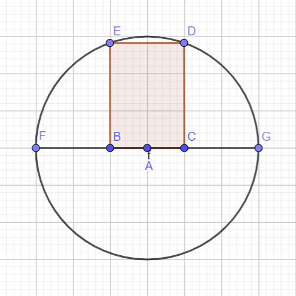
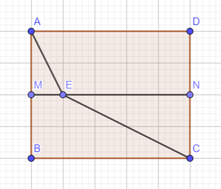

# Chương 1. Ứng dụng đạo hàm
## Bài 2. Giá trị lớn nhất - nhỏ nhất của hàm số

### 1. Lý thuyết

#### 1.1. Định nghĩa

**Định nghĩa:** Cho hàm số $y = f(x)$ xác định trên $D$.

- **Giá trị lớn nhất (GTLN):** Số $M$ được gọi là giá trị lớn nhất (GTLN) của hàm số $y = f(x)$ trên $D$ nếu: $\begin{cases} f(x) \leq M, \forall x \in D \\\ \exists x_0 \in D : f(x_0) = M \end{cases},$
  Khi đó ta kí hiệu $M = \max_{x \in D} f(x)$ hoặc $M = \max_D f(x)$.

- **Giá trị nhỏ nhất (GTNN):** Số $m$ được gọi là giá trị nhỏ nhất (GTNN) của hàm số $y = f(x)$ trên $D$ nếu: $\begin{cases} f(x) \geq m, \forall x \in D \\\ \exists x_0 \in D : f(x_0) = m \end{cases},$
  Khi đó ta kí hiệu $m = \min_{x \in D} f(x)$ hoặc $m = \min_D f(x)$.

**Chú ý:**
- Quy ước rằng khi nói GTLN và GTNN của hàm số $y = f(x)$ (mà không xét "trên tập $D$") thì ta hiểu đó là GTLN hay GTNN của $y = f(x)$ trên tập xác định của hàm số.
- Để tìm GTLN hay GTNN của hàm số trên tập $D$, ta thường lập bảng biến thiên của hàm số trên tập $D$ để kết luận.

### 2. Các dạng bài tập

#### Dạng 1. Giá trị lớn nhất – nhỏ nhất của hàm số trên đoạn

**Phương pháp:**

Tìm giá trị lớn nhất, giá trị nhỏ nhất của hàm số $f(x)$ liên tục trên đoạn $[a;b]$:

**Bước 1:** Tìm các điểm $x_1$, $x_2$, ..., $x_n$ thuộc $(a;b)$ sao cho $f^\prime (x) = 0$.

**Bước 2:** Tính $f(a)$, $f(x_1)$, $f(x_2)$, ..., $f(x_n)$, $f(b)$.

**Bước 3:** Gọi $M$ là số lớn nhất và $m$ là số nhỏ nhất trong các giá trị ở Bước 2. Khi đó $M = \max_{[a;b]} f(x)$ và $m = \min_{[a;b]} f(x)$.

**Ví dụ 1.1:** Tìm giá trị lớn nhất và nhỏ nhất của hàm số $f(x) = x³ - 3x + 1$ trên đoạn $[-2;2]$.

**Ví dụ 1.2:** Tìm giá trị lớn nhất và nhỏ nhất của hàm số $f(x) = x\sqrt{1-x²}$.

#### Dạng 2. Giá trị lớn nhất – nhỏ nhất của hàm số trên khoảng

**Phương pháp:**

Tìm giá trị lớn nhất, giá trị nhỏ nhất của hàm số $f(x)$ trên khoảng $(a;b)$:

**Bước 1:** Tìm điều kiện xác định của hàm số $y = f(x)$.
- $f(x)$ không liên tục trên $(a;b)$ ⇒ Không có giá trị lớn nhất, giá trị nhỏ nhất.
- $f(x)$ liên tục trên $(a;b)$ ⇒ Bước tiếp theo

**Bước 2:** Tính đạo hàm $y^\prime = f^\prime (x)$.

**Bước 3:** Tìm các điểm $f(x)$ thuộc $[a;b]$ sao cho:
- $f^\prime (x) = 0$, hoặc
- $f^\prime (x)$ không xác định.

**Bước 4:** Lập bảng biến thiên của hàm số $y = f(x)$ trên khoảng $(a;b)$ cho trước.

**Bước 5:** Xác định điểm "cao nhất" và điểm "thấp nhất" của đồ thị hàm số trên $(a;b)$.

**Bước 6:** Kết luận giá trị lớn nhất, giá trị nhỏ nhất của hàm số $y = f(x)$.

**Nhận xét:**
- ✓ Nếu đề bài không cho sẵn $(a;b)$ thì thường sẽ lấy luôn tập xác định làm khoảng phải xét.
- ✓ Đây là phương pháp tổng quát, tùy vào bài toán sẽ giản lược bớt 1 vài bước.

**Ví dụ 2.2:** Tìm giá trị lớn nhất của hàm số $y = -x² + 2x + 4$ trên khoảng $(0;3)$.

**Ví dụ 2.3:** Tìm giá trị lớn nhất và nhỏ nhất (nếu có) của hàm số $f(x) = x³ - 3x - 4$ trên $[-3;2)$.

**Ví dụ 2.4:** Tìm giá trị nhỏ nhất của hàm số $y = x + \dfrac{4}{x}$ trên khoảng $(0;+\infty)$.

**Ví dụ 2.5:** Tìm giá trị lớn nhất và nhỏ nhất (nếu có) của hàm số $f(x) = \dfrac{1}{x² - 1}$ trên $(-1; -\infty)$.

#### Dạng 3. Sử dụng cách đánh giá để tìm giá trị lớn nhất - nhỏ nhất

**Phương pháp:**

**1. Sử dụng bất đẳng thức thường gặp:**

- **Bất đẳng thức Cô-si (AM-GM):**
  - **Với hai số thực không âm:** $a+b \ge 2\sqrt{ab}$. Dấu bằng xảy ra khi và chỉ khi $a=b$.
  - **Với ba số thực không âm:** $a+b+c \ge 3\sqrt[3]{abc}$. Dấu bằng xảy ra khi và chỉ khi $a=b=c$.
  - **Với n số thực không âm:** $a_1 + a_2 + ... + a_n \ge n\sqrt[n]{a_1a_2...a_n}$. Dấu bằng xảy ra khi và chỉ khi $a_1=a_2=...=a_n$.

- **Bất đẳng thức Bunhiacopxki (Cauchy-Schwarz):**
  - **Dạng cơ bản:** $(a^2+b^2)(c^2+d^2) \ge (ac+bd)^2$. Dấu "=" xảy ra khi và chỉ khi $\dfrac{a}{c} = \dfrac{b}{d}$.
  - **Dạng tổng quát:** Với hai bộ số $(a_1, a_2, ..., a_n)$ và $(b_1, b_2, ..., b_n)$ ta có:
    $$(a_1^2+a_2^2+...+a_n^2)(b_1^2+b_2^2+...+b_n^2) \ge (a_1b_1+a_2b_2+...+a_nb_n)^2$$
    Dấu "=" xảy ra khi và chỉ khi $\dfrac{a_1}{b_1} = \dfrac{a_2}{b_2} = ... = \dfrac{a_n}{b_n}$.

**2. Sử dụng "Tập giá trị" của hàm số lượng giác:**

Dựa vào tập giá trị của hàm số lượng giác:
$$\begin{cases}
-1 \le \sin x \le 1 \\\\
-1 \le \cos x \le 1
\end{cases}
\implies
\begin{cases}
0 \le \sin^2 x \le 1 \\\\
0 \le \cos^2 x \le 1
\end{cases}$$

**Ví dụ 3.1:** Giả sử $M$ và $m$ lần lượt là GTLN và GTNN của hàm số $y = 2+3\sin x$. Tính $M+m$.

**Ví dụ 3.2:** Tìm giá trị nhỏ nhất của hàm số $f(x) = \dfrac{386x}{x^2 + 2x + 5}$ với $x > 0$.

#### Dạng 4. Ứng dụng giá trị lớn nhất – nhỏ nhất

**Phương pháp:**

**1. Bài toán bất phương trình:**

- **Bước 1:** Chuyển bất phương trình đã cho về dạng $f(x) - g(x) \ge 0$ và tìm điều kiện tồn tại của bất phương trình.
- **Bước 2:** Đặt hàm số $y = h(x) = f(x) - g(x)$.
- **Bước 3:** Xét tính đơn điệu của $y = h(x)$ trên điều kiện xác định. Từ đó kết luận về giá trị lớn nhất, giá trị nhỏ nhất.

**2. Bài toán bất phương trình chứa tham số:**

Ta đưa bất phương trình đề bài cho về một trong các dạng sau:

- $m \ge f(x)$ nghiệm đúng với mọi $x \in D$ thì $m \ge \max\limits_D f(x)$.
- $m \le f(x)$ nghiệm đúng với mọi $x \in D$ thì $m \le \min\limits_D f(x)$.
- $m \ge f(x)$ có nghiệm $x \in D$ thì $m \ge \min\limits_D f(x)$.
- $m \le f(x)$ có nghiệm $x \in D$ thì $m \le \max\limits_D f(x)$.

**3. Nhận xét: Nếu $y = f(x)$:**

- **✓ đồng biến trên $[a;b]$ thì:** $\begin{cases} \min\limits_{[a;b]} f(x) = f(a) \\\ \max\limits_{[a;b]} f(x) = f(b) \end{cases}$

- **✓ nghịch biến trên $[a;b]$ thì:** $\begin{cases} \min\limits_{[a;b]} f(x) = f(b) \\\ \max\limits_{[a;b]} f(x) = f(a) \end{cases}$

**Ví dụ 4.1:** Tìm $m$ để bất phương trình $x^3 - 3x - m > 0$ có nghiệm $x \in [0;2]$?

**Ví dụ 4.2:** Giải bất phương trình: $\sqrt{5x-1} + \sqrt{x+3} \ge 4$

**Ví dụ 4.3:** Giải bất phương trình: $\sqrt{2x^3 + 3x^2 + 6x + 16} - \sqrt{4 - x} \ge 2\sqrt{3}$

**Ví dụ 4.4:** Cho hàm số $y = f(x)$. Hàm số $y = f'(x)$ có bảng biến thiên như sau:

**Bảng biến thiên của $f'(x)$:**

| $x$ | $-\infty$ |  | $1$ | | $0$ | | $+\infty$ |
| :-- | :-------- | :-- | :-- | :-- | :-------- |---|---|
| $f(x)$ | $+\infty$          | $\searrow$     |  $-3$ | $\nearrow$ | $0$ | $\searrow$| $-\infty$ |

Biết bất phương trình $f(x) \gt \log x - m$ nghiệm đúng $\forall x \in (1;6) \Leftrightarrow m \ge \log a - f(a)$. Tính $a-b$.

#### Dạng 5. Bài toán thực tế áp dụng giá trị lớn nhất – nhỏ nhất

**Phương pháp:**

**Bước 1:** Gọi ẩn và xác định điều kiện cho ẩn.

**Bước 2:** Biểu diễn các đại lượng chưa biết theo ẩn số và các đại lượng đã biết.

**Bước 3:** Xét hàm số biểu thị đại lượng mà đề bài yêu cầu. Tìm giá trị lớn nhất, giá trị nhỏ nhất của hàm số đó trên điều kiện của ẩn.

**Bước 4:** Kết luận.

**Ví dụ 5.1:** Tính diện tích lớn nhất $S_{\text{max}}$ của một hình chữ nhật nội tiếp trong nửa đường tròn bán kính $R = 6\text{cm}$ nếu một cạnh của hình chữ nhật nằm dọc theo đường kính của hình tròn và hai đỉnh của hình chữ nhật nằm trên đường tròn.

**Ví dụ 5.2:** Một công ty cần sản xuất một sản phẩm trong đúng 10 ngày và phải sử dụng hai máy A và B. Máy A làm việc trong $x$ ngày cho lợi nhuận $x^3 + 2x$ (triệu đồng). Máy B làm việc trong $y$ ngày cho lợi nhuận $326y - 27y^3$ (triệu đồng). Hỏi công ty nên sử dụng máy A trong bao nhiêu ngày để tổng lợi nhuận đạt giá trị lớn nhất? (Biết rằng máy A và B không làm việc đồng thời, và máy B làm việc không quá 6 ngày).

**Ví dụ 5.3:** Một mảnh đất hình chữ nhật ABCD có chiều dài AB = 25m và chiều rộng AD = 20m. Mảnh đất được chia thành hai phần bằng nhau bởi một đường rào MN, trong đó M và N lần lượt là trung điểm của BC và AD. Một đội thi công xây dựng con đường từ điểm A đến điểm C, con đường này phải đi qua đường rào MN. Biết rằng khi xây dựng con đường trong vùng ABMN (phần trên), đội thi công có thể hoàn thành 15m/giờ, và khi xây dựng trong vùng CDNM (phần dưới), đội thi công có thể hoàn thành 30m/giờ. Tính thời gian ngắn nhất để đội thi công xây dựng xong toàn bộ con đường từ A đến C.

