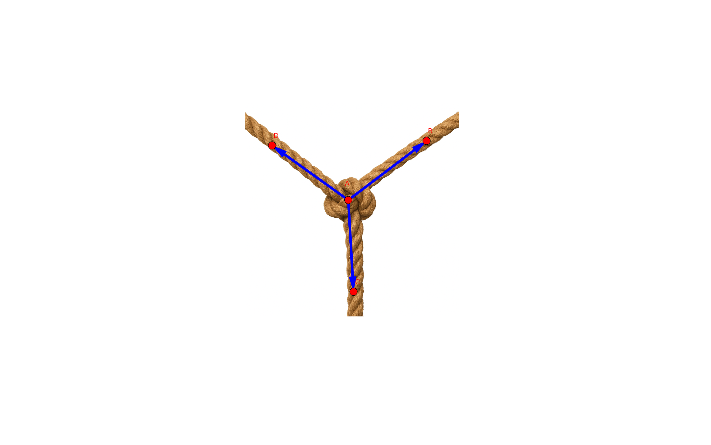


# Chương 2. Vector và hệ trục toạ độ trong không gian

## Bài 1. Vector trong không gian:

| Kiến thức cũ: Vector trong mặt phẳng | Trong không gian|
|---|---|
|Định nghĩa vector: Đoạn thẳng có hướng: Phương, chiều, độ lớn | Trong không gian: không thay đổi|
|Quy tắc cộng: Hình bình hành, 3 điểm| Trong không gian: Không đổi, thêm quy tắc hình hộp|
| Quy tắc trừ: lấy vector đối rồi cộng, hoặc $\vec{AB}=\vec{OB}-\vec{OA}$| Trong không gian: Không đổi|
|Quy tắc nhân với số: $\vec{k}\vec{a}$| Trong không gian: Không đổi|
|Điều kiện cùng phương: $\vec{a}$ và $\vec{b}$ cùng phương $\Leftrightarrow \vec{a}=k\vec{b}$| Trong không gian: Không đổi|
|Tích vô hướng: $\vec{a}.\vec{b}=\|\vec{a}\|.\|\vec{b}\|.\cos(\vec{a},\vec{b})$| Trong không gian: Không đổi|

### Chữa bài 2.9 sách kết nối:

Ba sợ dây không giãn với khối lượng không đáng kể buộc chung một đầu và được kéo căng về ba hướng khác nhau. Nếu các lực kéo làm cho ba sợi dây ở trạng thái đứng yên thì khi đó ba sợi dây nằm trên cùng một mặt phẳng. Hãy giải thích tại sao?

{:style="width:300px;"}

*Lời giải*:
- Điều kiện đồng thẳng của 3 đường thẳng đồng quy nó sẽ chuyển về điều kiện đồng phẳng của 4 điểm: $A$ là điểm đồng quy; $B$, $C$, $D$ là 3 điểm khác $A$ nằm trên 3 đường thẳng.

$A$, $B$, $C$, $D$ đồng phẳng $\Leftrightarrow \vec{AB}, \vec{AC}, \vec{AD}$ đồng phẳng tương đương: $\vec{AB}=a\vec{AC}+b\vec{AD}$ ($a,b\in \mathbb{R}$)

Gọi $A$ là nút, $B$, $C$, $D$ là 3 điểm nằm trên sợi dây sao cho $\vec{AB}=\vec{F}_1$, $\vec{AC}=\vec{F}_2$, $\vec{AD}=\vec{F}_3$.
Do điểm nút $A$ đứng yên nên $\vec{F}_1+\vec{F}_2+\vec{F}_3=\vec{0}$, tương đương $\vec{AB}+\vec{AC}+\vec{AD}=\vec{0}$.
Kéo theo: $\vec{AB}=-\vec{AC}-\vec{AD}$.( $a=-1, b=-1$).

