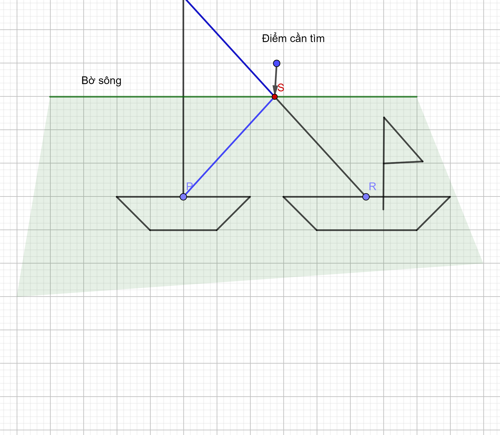


# Giải đáp
## Câu 20:
Mặt phẳng $Oxyz$: $A(2;-3;7), B(0,4,1), C(3,0,5)$ và $D(3,3,3).$ Gọi $M$ là điểm nằm trên mặt phẳng $(Oyz)$ sao cho $\left|\vec{MA}+\vec{MB}+\vec{MC}+\vec{MD}\right|$ nhỏ nhất. Khi đó tọa độ điểm $M(a,b,c)$. Tính $a+b+c$

*Phân tích*

$\left|\vec{MA}+\vec{MB}+\vec{MC}+\vec{MD}\right|$ nghĩ tới tâm tỉ cự của bốn điểm $A,B,C,D$ với bộ số: $(1,1,1,1)$.  

Gọi $G$ là điểm sao $\vec{GA}+\vec{GB}+\vec{GC}+\vec{GD}=\vec{0}$. Khi đó $G$ là tâm tỉ cự của bộ số $(1,1,1,1)$ ( hay còn gọi là trọng tâm của tứ diện $ABCD$) và $\vec{MA}+\vec{MB}+\vec{MC}+\vec{MD}=4\vec{MG}$. 
Vậy $\left|\vec{MA}+\vec{MB}+\vec{MC}+\vec{MD}\right|$ nhỏ nhất khi và chỉ khi $\left|\vec{MG}\right|$ nhỏ nhất.
Mà $M$ thuộc mặt phẳng $(Oyz)$ nên $M$ là hình chiếu của $G$ lên mặt phẳng $(Oyz)$. 
Toạ độ điểm $G$ là 

$$\begin{cases} x_G=\dfrac{1}{4}(2+0+3+3)=2\\ y_G=\dfrac{1}{4}(-3+4+0+3)=1\\ z_G=\dfrac{1}{4}(7+1+5+3)=4 \end{cases}$$

Hình chiếu của $G$ lên mặt phẳng $(Oyz)$ là $M(0,1,4)$. Khi đó $a+b+c=0+1+4=5$.

**Lời bình**
Khái niệm tâm tỉ cự xuất phát từ việc: mở rộng khái niệm trung điểm là tâm tỉ cự của hai điểm với bộ số $(1,1)$.

Ví dụ: Trung điểm $M$ của đoạn thẳng $AB$ có $\vec{MA}+\vec{MB}=0$, với mọi điểm $P$ trong không gian có $\vec{PA}+\vec{PB}=2\vec{PM}$. (Dựa vào quy tắc cộng vector qua 3 điểm $\vec{PA} = \vec{PM}+\vec{MA}$, $\vec{PB} = \vec{PM}+\vec{MB}$). 

Tìm $P$ nằm trên mặt phẳng $(Oyz)$ sao cho $$\|\vec{PA}+\vec{PB}\| $$ nhỏ nhất.

Khi đó $\left|\vec{PA}+\vec{PB}\right|$ = $2\left|\vec{PM}\right|\geq 0$. 
Dấu = khi $P$ trùng $M$.

Nhưng $P$ thuộc mặt phẳng $(Oyz)$ nên $P$ là chân đường cao hạ từ $M$ lên mặt phẳng $(Oyz)$.

*Tiếp theo*: Đổi hệ số của biểu thức vector thành: $$\|2\vec{PA}+3\vec{PB}\|$$ thì ta có thể tìm điểm $M$ sao cho $$ 2\vec{MA}+3\vec{MB} = 0.$$ Ta thu được $$2 \vec{PA}+3\vec{PB} = 5\vec{PM} $$

*Định nghĩa:* Cho $n$ điểm $A_1,A_2,\dots, A_n$ và $n$ số thực $k_1,k_2,\dots, k_n$ có tổng $k_1+k_2+\dots+k_n\neq0$. Khi đó tồn tại duy nhất điểm $G$ sao cho $\vec{k_1}\vec{GA_1}+\vec{k_2}\vec{GA_2}+\dots+\vec{k_n}\vec{GA_n} = \vec{0}$. Điểm $G$ được gọi là tâm tỉ cự của bộ điểm $(A_1,A_2,\dots, A_n)$ với hệ số $(k_1,k_2,\dots, k_n)$.

*Bài toán mở rộng 1*: (Thay đổi hệ số)

Mặt phẳng $Oxyz$: $A(2;-3;7), B(0,4,1), C(3,0,5)$ và $D(3,3,3).$ Gọi $M$ là điểm nằm trên mặt phẳng $(Oyz)$ sao cho $$ \| 2\vec{MA}+3\vec{MB}+4\vec{MC}+\vec{MD} \|$$ nhỏ nhất. Khi đó tọa độ điểm $$M(a,b,c).$$ Tính $$a+b+c$$

*Giải*:

Gọi $I$ là tâm tỉ cự của bộ điểm $(A,B,C,D)$ với hệ số $(2,3,4,1)$. Khi đó $I$ có:

$$ 2\vec{IA}+3\vec{IB}+4\vec{IC}+\vec{ID}=\vec{0}$$

Thay toạ độ vào biểu thức vector:

$2(2-x_I, -3-y_I, 7-z_I)+3(0-x_I, 4-y_I, 1-z_I)+4(3-x_I, 0-y_I, 5-z_I)+(3-x_I, 3-y_I, 3-z_I)=\vec{0}$

$(4-2x_I-3x_I+12-4x_I+3-x_I, -6-2y_I+12-3y_I-4y_I+3-y_I, 14-2z_I+3-3z_I+20-4z_I+3-z_I)=\vec{0}$

Thu gọn ta có: 

$$\begin{cases} 19-10x_I=0 \\ 9-10y_I=0\\ 40-10z_I=0 \end{cases}\Rightarrow \begin{cases} x_I=\dfrac{19}{10}\\ y_I=\dfrac{9}{10}\\ z_I=\dfrac{4}{10} \end{cases}$$

*Bài toán mở rộng 2*: Dạng tổng bình phương của độ dài đoạn thẳng:

Mặt phẳng $Oxyz$: $A(2;-3;7), B(0,4,1), C(3,0,5)$ và $D(3,3,3).$ Gọi $M$ là điểm nằm trên mặt phẳng $(Oyz)$ sao cho $2MA^2+3MB^2+4MC^2+MD^2$ nhỏ nhất. Khi đó tọa độ điểm $M(a,b,c)$. Tính $a+b+c$

*Giải*
*Cách tiếp cận 1*: dùng toạ độ:

$$ M\in (Oyz)\Rightarrow M(0,b,c)\Rightarrow \begin{cases} MA^2=4+(b+3)^2+(c-7)^2 \\ MB^2=(b-4)^2+(c-1)^2 \\ MC^2=9+b^2+(c-5)^2 \\ MD^2=9+(b-3)^2+(c-3)^2 \end{cases} $$

Biểu thức này có 2 ẩn không đưa về được hàm số 1 ẩn.

(cách của đại học phát triển từ cách của cấp 3: 

Tìm min,max của hàm số $f(x)$ khả vi trên đoạn $[a,b]$

B1. $f'(x)=0$ có nghiệm $$x_1,x_2,\dots,x_n$$

B2. Kiểm tra $x_1,x_2,\dots,x_n$ có thuộc đoạn $[a,b]$ không?

B3. Tính $f(x_1),f(x_2),\dots,f(x_n)$

B4. So sánh $f(x_1),f(x_2),\dots,f(x_n)$ và $f(a),f(b)$ tìm min,max

Cách tiếp cận ở đại học:

Hàm 2 biến $f(b,c) =4+(b+3)^2+(c-7)^2+(b-4)^2+(c-1)^2+9+b^2+(c-5)^2+9+(b-3)^2+(c-3)^2 $

Bước 1. $f'(b)=0$. chuyển thành 

$$\begin{cases}f'_b(b,c)=0 \\ f'_c(b,c)=0 \end{cases}$$

Ta có: 

$$\begin{cases}f'_b(b,c)=2(b+3)+2(b-4)+2b+2(b-3)=0 \\ f'_c(b,c)=2(c-7)+2(c-1)+2(c-5)+2(c-3)=0 \end{cases}$$

Giải ra tìm $a,b$ thay giá trị tạo các nghiệm của hệ

Bước 2. So sánh giá trị của hàm số tại các nghiệm và tại các điểm đầu mút. (Trong trường hợp này thì $(Oyz)$ không có điểm đầu mút)

Bước 3. Kết luận.

*Chú ý*

Cách tiếp cận ở đại học có thể áp dụng cho các bài toán tìm min,max của hàm số nhiều biến. Cách tiếp cận 1 có thể áp dụng cho các bài toán tìm min,max của hàm số 1 biến ($M$ thuộc đường thẳng, dựa trên công thức tham số của đường thẳng 

$$\begin{cases} x=x_0+at \\ y=y_0+bt \\ z=z_0+ct \end{cases}$$

thì biểu thức sẽ chỉ có một ẩn là $t$).

Như vậy, ở một mức độ phổ thông thì khi biểu thức có chứa đối tượng có thể thay đổi, ta thường tìm cách chuyển về biểu thức có chứa một đối tượng thay đổi.

*Cách tiếp cận 2*:

Do biểu thức có 4 điểm, để dễ dàng hơn, ta có thể làm từ dạng dễ nhất:

- Nếu chỉ có 1 điểm $A$: $MA^2$ nhỏ nhất: $M$ là chân đường vuông góc của A tới mặt.

- Nếu có 2 điểm $A,B$: $2MA^2+3MB^2$ nhỏ nhất.

Gọi $I$ là tâm tỉ cự của bộ điểm $(A,B)$ với hệ số $(2,3)$. Khi đó $I$ có:

$2\vec{IA}+3\vec{IB}=\vec{0}$

$MA^2=\vec{MA}.\vec{MA}=(\vec{MI}+\vec{IA}).(\vec{MI}+\vec{IA})=\vec{MI}.\vec{MI}+2\vec{MI}.\vec{IA}+\vec{IA}.\vec{IA}$

$MB^2=\vec{MB}.\vec{MB}=(\vec{MI}+\vec{IB}).(\vec{MI}+\vec{IB})=\vec{MI}.\vec{MI}+2\vec{MI}.\vec{IB}+\vec{IB}.\vec{IB}$

Nếu có $I$ cố định $IA, IB$ cố định, còn tích vô hướng $2\vec{MI}(2\vec{IA}+3\vec{IB})$ là hằng số. (hằng số đẹp nhất là số $0$)

Chọn $I$ sao cho: $2\vec{IA}+3\vec{IB} =0$

Trường hợp nhỏ thứ 3: 3 điểm: $2MA^2+3MB^2+4MC^2$
Tương tự chọn điểm $I$: 
$MA^2=\vec{MA}.\vec{MA}=(\vec{MI}+\vec{IA}).(\vec{MI}+\vec{IA})=\vec{MI}.\vec{MI}+2\vec{MI}.\vec{IA}+\vec{IA}.\vec{IA}$ $MB^2=\vec{MB}.\vec{MB}=(\vec{MI}+\vec{IB}).(\vec{MI}+\vec{IB})=\vec{MI}.\vec{MI}+2\vec{MI}.\vec{IB}+\vec{IB}.\vec{IB}$
$MC^2=\vec{MC}.\vec{MC}=(\vec{MI}+\vec{IC})(\vec{MI}+\vec{IC})=\vec{MI}.\vec{MI}+2\vec{MI}.\vec{IB}+\vec{IB}.\vec{IB}$
Tìm $I$ sao cho $2\vec{MI}(2\vec{IA}+3\vec{IB}+4\vec{IC})=0$

Như vậy, cách tiếp cận 2 có thể giải bài toán này cho trường hợp 4 điểm và vẫn dùng khái niệm tâm tỉ cự.

Ngoài ra, chúng ta còn có 1 dạng bài kinh điển được học ở lớp 7: 

Đầu bài: Có 2 con thuyền trên sông, bờ sông là đường thẳng, tìm vị trí trên bờ sông để làm bến đò sao cho tổng khoảng cách từ 2 con thuyền tới bến đò là nhỏ nhất.

(Để giải bài này ở cấp hai chúng ta thường sử dụng: Bất đẳng thức trong tam giác. Lời giải được mô tả như trong hình vẽ bên dưới)

$MA+MB\geq AB$ (không xảy ra dấu =).

### Tổng kết:
Dạng tìm min, max tổng khoảng cách có mấy dạng thường gặp:

- Cho $A_1,A_2,\dots, A_n$ tìm $M$ sao cho

  $$\left|a_1\vec{MA_1}+a_2\vec{MA_2}+\dots + a_n\vec{MA_n}\right|$$
  hoặc
     $$ a_1MA_1^2+a_2MA_2^2+\dots + a_nMA_n^2 $$  
nhỏ nhất.

(Phương pháp: Tâm tỉ cự: Tìm $I$ sao cho 

$$a_1\vec{IA_1}+a_2\vec{IA_2}+\dots + a_n\vec{IA_n}=0$$ 
  
- Thuần hình học: Cho 2 điểm $A,B$ tìm $M$ sao cho $MA+MB$ min, $\|MA-MB\| $ max.(Phương pháp lấy đối xứng và bất đẳng thức trong tam giác: Tổng 2 cạnh lớn cạnh còn lại, và hiệu 2 cạnh nhỏ hơn cạnh còn lại) (Nếu cho 3 điểm -> bài toán khó, giải cách dị trừ khi $M$ thuộc đường thẳng (có công thức dạng tham số) hàm số 1 ẩn và sử dụng bảng biến thiên để giải)

[👉 Về trang chủ](../index.md)

