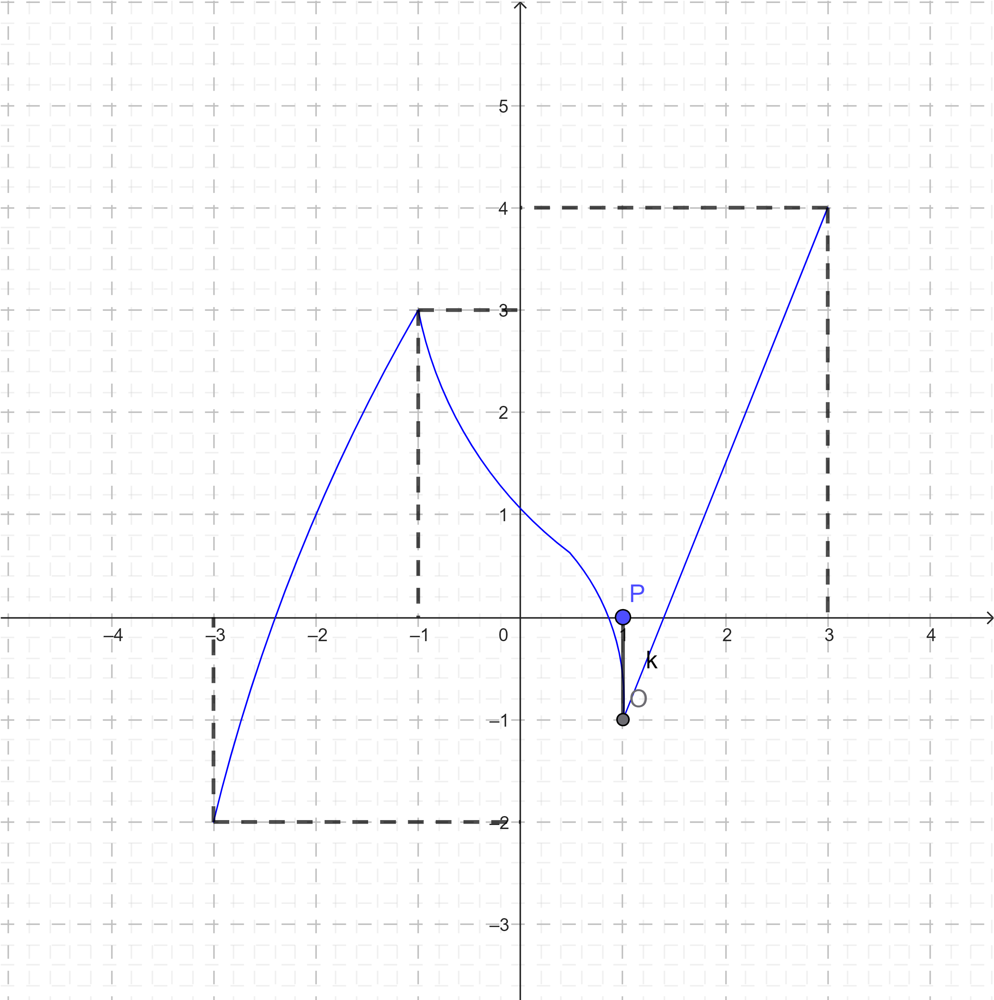

# Chương 1. Ứng dụng đạo hàm
## Đơn điệu và cực trị của hàm số
### Lý thuyết

#### 1. Tính đồng biến, nghịch biến của hàm số

**Định nghĩa:**
Kí hiệu $K$ là khoảng; đoạn; nửa khoảng. Giả sử hàm số $y = f(x)$ xác định trên $K$.

**Hàm số $y = f(x)$:**
- **Gọi là đồng biến trên $K$** nếu $\forall x_1, x_2 \in K$ mà $x_1 \lt x_2$ thì $f(x_1) \lt f(x_2)$.
- **Gọi là nghịch biến trên $K$** nếu $\forall x_1, x_2 \in K$ mà $x_1 \lt x_2$ thì $f(x_1) \gt f(x_2)$.

**Chú ý:**
- Hàm số $y = f(x)$ đồng biến trên $K$ thì đồ thị đi lên từ trái sang phải.
- Hàm số $y = f(x)$ nghịch biến trên $K$ thì đồ thị đi xuống từ trái sang phải.

#### 2. Tính đơn điệu của hàm số

**Định lý:**
Cho hàm số $y = f(x)$ có đạo hàm trên $K$.

- Nếu $f'(x) \gt 0$ với mọi $x$ thuộc $K$ thì hàm số $y = f(x)$ đồng biến trên $K$.
- Nếu $f'(x) \lt 0$ với mọi $x$ thuộc $K$ thì hàm số $y = f(x)$ nghịch biến trên $K$.

**Chú ý:**
- Định lí vẫn đúng trong trường hợp $f^\prime (x) = 0$ tại một số hữu hạn điểm trong $K$.
- Nếu $f^\prime (x) = 0$ với mọi $x \in K$ thì hàm số $f(x)$ không đổi trên khoảng $K$.

#### 3. Khái niệm cực trị của hàm số

**Định nghĩa:**
Cho hàm số $y = f(x)$ xác định và liên tục trên khoảng $(a;b)$ (a có thể là $-\infty$, b có thể là $+\infty$) và điểm $x_0 \in (a;b)$.

- **Cực đại:** $\exists h \gt 0$ sao cho $f(x) \lt f(x_0)$ với mọi $x \in (x_0-h; x_0+h) \subset (a;b)$ và $x \neq x_0$ thì ta nói hàm số $f(x)$ đạt cực đại tại $x_0$.
- **Cực tiểu:** $\exists h \gt 0$ sao cho $f(x) \gt f(x_0)$ với mọi $x \in (x_0-h; x_0+h) \subset (a;b)$ và $x \neq x_0$ thì ta nói hàm số $f(x)$ đạt cực tiểu tại $x_0$.

**Chú ý:**

**Đối với cực đại:**
- Hàm số $y = f(x)$ đạt cực đại tại $x_0$ thì $x_0$ được gọi là điểm cực đại của hàm số $f(x)$. Khi đó, $f(x_0)$ được gọi là giá trị cực đại của hàm số $f(x)$ và kí hiệu là $f_{CĐ}$ hay $y_{CĐ}$.
- Điểm $M_0(x_0; f(x_0))$ được gọi là điểm cực đại của đồ thị hàm số.

**Đối với cực tiểu:**
- Hàm số $y = f(x)$ đạt cực tiểu tại $x_0$ thì $x_0$ được gọi là điểm cực tiểu của hàm số $f(x)$. Khi đó, $f(x_0)$ được gọi là giá trị cực tiểu của hàm số $f(x)$ và kí hiệu là $f_{CT}$ hay $y_{CT}$.
- Điểm $M_0(x_0; f(x_0))$ được gọi là điểm cực tiểu của đồ thị hàm số.

**Tổng quát:**
- Các điểm cực đại và điểm cực tiểu được gọi chung là điểm cực trị.
- Giá trị cực đại và giá trị cực tiểu được gọi chung là giá trị cực trị (cực trị) của hàm số.

#### 4. Cách tìm cực trị của hàm số

**Định lý:**
Giả sử hàm số $y = f(x)$ liên tục trên khoảng $(a;b)$ chứa điểm $x_0$ và có đạo hàm trên các khoảng $(a; x_0)$ và $(x_0; b)$. Khi đó:

- **Điều kiện cực tiểu:** Nếu $f'(x) \lt 0$ với mọi $x \in (a; x_0)$ và $f'(x) \gt 0$ với mọi $x \in (x_0; b)$ thì $x_0$ là một điểm cực tiểu của hàm số $f(x)$.
- **Điều kiện cực đại:** Nếu $f'(x) \gt 0$ với mọi $x \in (a; x_0)$ và $f'(x) \lt 0$ với mọi $x \in (x_0; b)$ thì $x_0$ là một điểm cực đại của hàm số $f(x)$.

**Bảng biến thiên:**

**Cực tiểu:**
| $x$ | $(a, x_0)$ | $x_0$ | $(x_0, b)$ |
|---|----------|----|----------|
| $f'(x)$ | - | \| | + |
| $f(x)$ | ↘ | Cực tiểu | ↗ |

**Cực đại:**
| $x$ | $(a, x_0)$ | $x_0$ | $(x_0, b)$ |
|---|----------|----|----------|
| $f'(x)$ | + | \| | - |
| $f(x)$ | ↗ | Cực đại | ↘ |

**Chú ý:**
- Mũi tên ↘ biểu thị hàm số giảm (nghịch biến)
- Mũi tên ↗ biểu thị hàm số tăng (đồng biến)
- Dấu \| biểu thị điểm $x_0$ (điểm cực trị)

#### 5. Các bước tìm cực trị của hàm số

**Chú ý:**
Từ định lí trên ta có các bước tìm cực trị của hàm số $y = f(x)$ như sau:

1. *Tìm tập xác định của hàm số.*
2. *Tính $f^\prime (x)$. Tìm các điểm mà tại đó $f^\prime (x)$ bằng 0 hoặc $f^\prime (x)$ không tồn tại.*
3. *Lập bảng biến thiên suy ra các cực trị của hàm số.*

**Trường hợp đặc biệt:**
Nếu $f^\prime (x_0) = 0$ nhưng $f^\prime (x)$ không đổi dấu khi $x$ qua $x_0$ thì $x_0$ không phải là điểm cực trị của hàm số.

**Ví dụ:** Hàm số $f(x) = x^3$ có:
- $f^\prime (x) = 3x^2$
- $f^\prime (0) = 0$

Nhưng $x = 0$ không phải là điểm cực trị của hàm số vì $f^\prime (x) = 3x^2 \geq 0$ với mọi $x$, tức là $f^\prime (x)$ không đổi dấu khi $x$ qua $x = 0$.

### Các dạng bài tập

#### Dạng 1. Xét tính đơn điệu của hàm số cho bởi một công thức

**Phương pháp:**

1. **Bước 1:** Tìm tập xác định $D$ của hàm số.
2. **Bước 2:** Tính đạo hàm $f^\prime (x)$ của các hàm số. Tìm các điểm $\{x_1; x_2; ...; x_n\} \in D$ mà tại đó đạo hàm $f^\prime (x)$ bằng 0 hoặc không tồn tại.
3. **Bước 3:** Sắp xếp các điểm $x_1; x_2; ...; x_n$ theo thứ tự tăng dần. Xét dấu $f^\prime (x)$ và lập bảng biến thiên.
4. **Bước 4:** Nêu kết luận về các khoảng đồng biến, nghịch biến của hàm số.

**Ví dụ 1.1.** Xét tính đơn điệu của hàm số $y = 4x^3 + 3x^2 - 36x + 6$.

**Ví dụ 1.2.** Xét tính đơn điệu của hàm số $f(x) = \dfrac{x - 1}{x + 1}$.

**Ví dụ 1.3.** Xét tính đơn điệu của hàm số $y = \sqrt{-x^2 + 4}$.

**Ví dụ 1.4.** Xét tính đơn điệu của hàm số $y = \log_3 (x^2 - 2x)$.

##### Dạng 2. Xét tính đơn điệu của hàm số khi biết bảng biến thiên hoặc đồ thị

**Phương pháp:**
- Với đồ thị hàm số, quan sát: hướng lên – xuống của đường cong (chiều từ trái sang phải).
- Với bảng biến thiên, quan sát: hướng lên – xuống của mũi tên (chiều từ trái sang phải).
- Với bảng xét dấu, quan sát: dấu âm - dương của $f^\prime (x)$.

**Ví dụ 2.1.**
Cho hàm số $y = f(x)$ xác định trên $\mathbb{R}$ và có bảng biến thiên như sau:

| $x$   | $-\infty$ | | $0$   | | $1$   | | $+\infty$ |
| :---- |:---:| :-------- | :---- |:---:| :---- |:---:| :-------- |
| $y'$  |           | $+$   | $0$   | $-$   | $0$   | $+$       |
| $y$   | $-\infty$ | $\quad \nearrow \quad$ | $-1$ | $\quad \searrow \quad$ | $-2$ | $\quad \nearrow \quad$ | $+\infty$ |

Xét tính đơn điệu của hàm số $y = f(x)$.

**Ví dụ 2.2.**
Cho hàm số $y = f(x)$ liên tục trên đoạn $[-3;3]$ và có đồ thị như hình bên. Xét tính đơn điệu của hàm số $y = f(x)$.

##### Dạng 3. Xác định cực trị của hàm số cho bởi công thức

**Phương pháp:**

1. **Bước 1:** Tìm tập xác định $D$ của hàm số.
2. **Bước 2:** Tính đạo hàm $f^\prime (x)$ của các hàm số. Tìm các điểm $\{x_1; x_2; ...; x_n\} \in D$ mà tại đó đạo hàm $f^\prime (x)=0$ hoặc $f^\prime (x)$ không tồn tại.
3. **Bước 3:** Sắp xếp các điểm $x_1; x_2; ...; x_n$ theo thứ tự tăng dần. Xét dấu $f'(x)$ và lập bảng biến thiên.
4. **Bước 4:** Kết luận hàm số đạt cực trị tại $x = ?$, $y = ?$ (nếu có).

**Ví dụ 3.1.** Tìm cực trị của hàm số $y = 2x^3 - 3x^2 + 1$.

**Ví dụ 3.2.** Tìm cực trị của hàm số $y = -x^4 + 2x^3 - 2x - 1$.

**Ví dụ 3.3.** Tìm cực trị của hàm số $y = \dfrac{x+2}{3x-1}$.

**Ví dụ 3.4.** Tìm cực trị của hàm số $y = \dfrac{x^2 - 4x + 4}{1 - x}$.

**Ví dụ 3.5.** Tìm cực trị của hàm số $f(x) = 2^{x^2 - 5x}$.

##### Dạng 4. Xác định cực trị của hàm số cho bởi bảng biến thiên – đồ thị

**Phương pháp:**

**Nhận xét:**
| Hàm số $f(x)$ | $f^\prime (x)$ đổi dấu |
|----------------|---------------|
| có cực trị | $f^\prime (x)$ đổi dấu |
| không cực trị | $f^\prime (x)$ không đổi dấu |
| chỉ có 1 cực trị | $f^\prime (x)$ đổi dấu 1 lần |
| có 2 cực trị | $f^\prime (x)$ đổi dấu 2 lần |
| có 3 cực trị | $f^\prime (x)$ đổi dấu 3 lần |

**Quy tắc chung:** Đối với một hàm số khả vi, hàm số chỉ có thể đạt cực trị tại những điểm $x_0$ mà tại đó đạo hàm triệt tiêu $f^\prime (x_0) = 0$ hoặc đạo hàm không xác định tại đó.

**Ví dụ 4.1.**
Cho hàm số $y = f(x)$ có đạo hàm trên $\mathbb{R}$ và đồ thị hàm số $y = f^\prime (x)$ như hình bên. Đồ thị hàm số $y = f(x)$ có bao nhiêu điểm cực tiểu và điểm cực đại?

**Ví dụ 4.2.**
Cho hàm số $y = f(x)$ có bảng biến thiên như sau:

| $x$   | $-\infty$ | | $-1$  | |         |  $0$ |   |   |$1$ | | $+\infty$ |
| :---- |:---: | :-------- |:---: | :---- | :---: | :---------- |:---: | :---- | :---: | --- | --- |
| $y^\prime$ | | $+$   | $0$   |  $-$ | | $\\|$  | | $-$   | $0$   | $+$ |       |
| $y$   | $-\infty$ | $\nearrow$ | $2$   | $\searrow$  | $-\infty$   | $\\|$  | $+\infty$ | $\searrow$  | $4$   | $\nearrow$ | $+\infty$ |

Hàm số $y = f(x)$ có bao nhiêu điểm cực tiểu và điểm cực đại?

**Ví dụ 4.3.**
Cho hàm số $y = f(x) = ax^3 + bx^2 + cx + d$ có bảng biến thiên như sau:

| $x$   | $-\infty$ | | $0$   | | $3$  | | $+\infty$ |
| :---- | :-------- | :---: | :---- | :---: | :---- | --- | :-------- |
| $f'(x)$ |           | $+$   | $0$   | $-$   | $0$   | $+$       | | |
| $f(x)$ | $-\infty$ | $\nearrow$ | $2$   | $\searrow$  | $-4$ | $\nearrow$ | $+\infty$ | | |

Dựa vào bảng biến thiên, hãy thiết lập công thức hàm số $y = f(x)$ đã cho?

##### Dạng 5. Toán thực tế áp dụng tính đơn điệu của hàm số

**Phương pháp:**

- *Nếu hàm số $s = f(t)$ biểu thị quãng đường di chuyển của vật theo thời gian $t$ thì $f^\prime (t_0)$ biểu thị tốc độ tức thời của chuyển động tại $t_0$.*
- *Đạo hàm cấp hai $f^{\prime \prime} (t)$ là gia tốc tức thời tại thời điểm $t$ của vật chuyển động có phương trình $s = f(t)$.*

**Ví dụ 5.1.**
Trong 8 phút đầu kể từ khi xuất phát, độ cao $h$ (tính bằng mét) của khinh khí cầu vào thời điểm $t$ phút được cho bởi $h(t) = 6t^3 - 81t^2 + 324t$. Trong các khoảng thời gian nào khinh khí cầu tăng dần độ cao, giảm dần độ cao?

**Ví dụ 5.2.**
Xét một chất điểm chuyển động dọc theo trục $Ox$. Tọa độ của chất điểm tại thời điểm $t$ (giây) được xác định bởi hàm số $x(t) = t^3 - 6t^2 + 9t$ với $t \geq 0$. Khi đó $x^\prime (t)$ là vận tốc của chất điểm tại thời điểm $t$, kí hiệu $v(t)$. Trong khoảng thời gian nào vận tốc của chất điểm tăng, trong khoảng thời gian nào vận tốc của chất điểm giảm?

##### Dạng 6. Bài toán liên quan tính đơn điệu có chứa tham số

**Phương pháp:**

*1. Tìm tham số $m$ để hàm số $y = ax^3 + bx^2 + cx + d$ đơn điệu trên tập xác định:*

- **Bước 1:** Tập xác định $D = \mathbb{R}$. Tính đạo hàm $y' = 3ax^2 + 2bx + c$.

- **Bước 2:** 
  - Để $y$ đồng biến trên $\mathbb{R}$: $y' \geq 0$ với mọi $x \in \mathbb{R}$ $\Leftrightarrow$ $a \gt 0$ và $\Delta_{y'} \leq 0$.
  - Để $y$ nghịch biến trên $\mathbb{R}$: $y' \leq 0$ với mọi $x \in \mathbb{R}$ $\Leftrightarrow$ $a \lt 0$ và $\Delta_{y'} \leq 0$.

*2. Tìm tham số $m$ để hàm số $y = \dfrac{ax + b}{cx + d}$ đơn điệu trên mỗi khoảng xác định:*

- **Bước 1:** Tập xác định $D = \mathbb{R} \setminus \left\{-\dfrac{d}{c}\right\}$. Tính đạo hàm $y' = \dfrac{ad - cb}{(cx + d)^2}$.
- **Bước 2:**
  - Để $y$ đồng biến trên mỗi khoảng xác định: $y' \gt 0$ $\Leftrightarrow$ $ad - bc \gt 0$.
  - Để $y$ nghịch biến trên mỗi khoảng xác định: $y' < 0$ $\Leftrightarrow$ $ad - bc \lt 0$.

**Ví dụ 6.1.**
Cho hàm số $y = -\dfrac{1}{3}x^3 - mx^2 + (3m + 2)x - 2$. Xác định điều kiện của tham số $m$ để hàm số nghịch biến trên khoảng $(-\infty; +\infty)$.

**Ví dụ 6.2.**
Cho hàm số $y = \dfrac{2x - m}{x - 1}$. Xác định điều kiện của tham số $m$ để hàm số đồng biến trên mỗi khoảng xác định của nó.

##### Dạng 7. Bài toán hàm hợp

**Phương pháp:**
Tìm khoảng đơn điệu của hàm số $y = f(u(x))$ từ bảng biến thiên/đồ thị của $f^\prime (x)$.

1. **Bước 1:** Tính $y^\prime = u^\prime \cdot f^\prime (u) \Rightarrow y^\prime = 0 \Leftrightarrow \begin{cases} u^\prime = 0 \\ f^\prime (u) = 0 \end{cases}$ ($*$)

2. **Bước 2:** Để giải ($*$) ta tìm $f^\prime (x) = 0$ (đồ thị cắt trục hoành). Giả sử $f^\prime (x) = 0 \Leftrightarrow \begin{cases} x = a \\ \vdots \\ x = b \end{cases} \Rightarrow f^\prime (u) = 0 \Leftrightarrow \begin{cases} u = a \\ \vdots \\ u = b \end{cases}$ → nghiệm của ($*$).

3. **Bước 3:** Lập bảng xét dấu của $y^\prime = u^\prime \cdot f^\prime (u) \Rightarrow$ khoảng đơn điệu cần tìm.

**Lưu ý:** Bài toán tìm cực trị của hàm số $y = f(u(x))$ ta làm tương tự.

**Ví dụ 7.1.**
Cho hàm số $f(x)$ có bảng xét dấu đạo hàm như hình bên dưới. Xác định các khoảng đồng biến của hàm số $y = f(1-2x)$.

| $x$ | $-\infty$ | | $-3$  | | $-2$  | | $0$   | | $1$   | | $3$   | | $+\infty$ |
| :-------- | :-------- | :---- | :---- | :---- | :---- | :---- | :---- | :---- | :---- | :---- |---|---|---|
| $f'(x)$   |           | $-$   | $0$   | $+$   | $0$   | $-$   | $0$   | $-$   | $0$   | $+$   | $0$   | $-$   | |

**Ví dụ 7.2.**
Cho hàm số $y = f(x)$ có đồ thị đạo hàm $y = f'(x)$ như hình vẽ. Xác định các khoảng nghịch biến của hàm số $g(x) = f(x^2 - 2)$.

**Ví dụ 7.3.**
Cho hàm số $y = f(x)$ có đạo hàm $f'(x) = (x^2 - 1)(x - 4)$ với mọi $x \in \mathbb{R}$. Hàm số $g(x) = f(3-x)$ có bao nhiêu điểm cực trị?

**Ví dụ 7.4.**
Cho hàm số $y = f(x)$ có đạo hàm trên $\mathbb{R}$ và có bảng xét dấu $f'(x)$ như sau:

| $x$       | $-\infty$ | $-2$  | $1$   | $3$   | $+\infty$ |
| :-------- | :-------- | :---- | :---- | :---- | :-------- |
| $f'(x)$   |           | $-$   | $0$   | $+$   | $0$   | $+$   | $0$   | $-$       |

Hỏi hàm số $y = f(x^2 - 2x)$ có bao nhiêu điểm cực tiểu?

