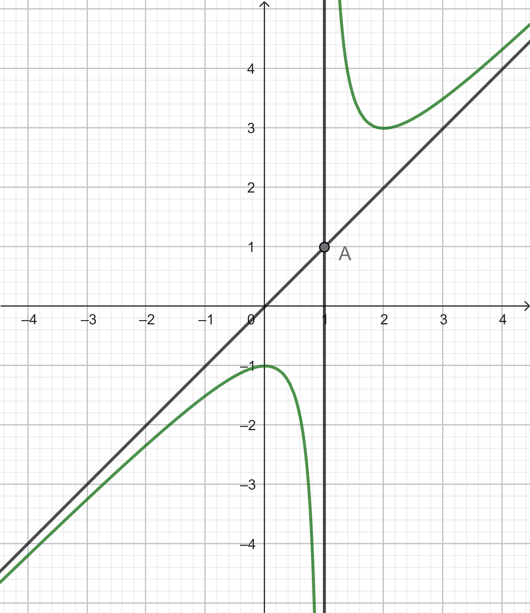

# Chương 1. Ứng dụng đạo hàm
## Bài 3.  Đường tiệm cận của đồ thị hàm số
### Lý thuyết
#### Đường tiệm cận ngang
- Đường thẳng $y=y_0$ gọi là đường tiệm cận ngang (gọi tắt là tiệm cận ngang) của đồ thị hàm số $y=f(x)$ nếu $$\lim_{x\to +\infty}f(x)=y_0 \text{ hoặc } \lim_{x\to - \infty}f(x)=y_0. $$
#### Đường tiệm cận đứng
- Đường thẳng $x=x_0$ gọi là đường tiệm cận đướng (gọi tắt là tiệm cận đứng) của đồ thị hàm số $y=f(x)$ nếu ít nhất một trong các điều kiện sau được thỏa mãn: 
$$\left[ \begin{array}{l}
		 \lim\limits_{x\to x_o^+}f(x)=+\infty; \\\\
		 \lim\limits_{x\to x_o^+}f(x)=-\infty; \\\\
		 \lim\limits_{x\to x_o^-}f(x)=+\infty; \\\\
		 \lim\limits_{x\to x_o^-}f(x)=-\infty; \\\\
		 \end{array} \right.$$
#### Đường tiệm cận xiên
- Đường thẳng $y=ax+b(a\neq 0)$ gọi là đường tiệm cận xiên (gọi tắt là tiệm cận xiên) của đồ thị hàm số $y=f(x)$ nếu $$ \lim_{x\to +\infty}[f(x)-(ax+b)]=0 \text{ hoặc } \lim_{x\to -\infty}[f(x)-(ax+b)]=0. $$
### Các dạng bài tập
#### Dạng 1. Tìm các đường tiệm cận khi cho bảng biến thiên - đồ thị 
##### Phương pháp
- **Bước 1:** Tìm tập xác định của hàm số. Giả sử  
$$D = (-\infty; +\infty) \setminus \\\{x_0\\\}.$$

- **Bước 2:** Quan sát Bảng biến thiên hoặc đồ thị, tìm giới hạn  

- Nếu  
$$\lim_{x \to +\infty} y = y_0 \quad \text{hoặc} \quad \lim_{x \to -\infty} y = y_0$$  
thì $y = y_0$ là **đường tiệm cận ngang** của đồ thị hàm số.

- Nếu  
$$
\lim_{x \to x_0^+} y = \pm \infty \quad \text{hoặc} \quad \lim_{x \to x_0^-} y = \pm \infty $$  
thì $x = x_0$ là **đường tiệm cận đứng** của đồ thị hàm số.

- Nếu  
$$ \lim_{x \to +\infty} \Big[y - (ax+b)\Big] = 0 \quad \text{hoặc} \quad \lim_{x \to -\infty} \Big[y - (ax+b)\Big] = 0 $$ 
thì $y = ax+b$ là **tiệm cận xiên** của đồ thị hàm số.

##### Chú ý
- Nếu $\lim_{x \to +\infty} y = y_1$ và $\lim_{x \to -\infty} y = y_2$ thì ta có **hai đường tiệm cận ngang**: $y = y_1, y = y_2$.
- Nếu tập xác định **không chứa** $+\infty, -\infty$ thì đồ thị hàm số **không có tiệm cận ngang**.
- Nếu hàm số xác định trên $\mathbb{R}$ thì đồ thị **không có tiệm cận đứng**.

#### Ví dụ 1.1
Cho hàm số $y = f(x)$ có bảng biến thiên sau:

|$x$| $-\infty$ | | $0$ | | $3$| | $+\infty$ |
|---|---|---|---|---|---|---|---|
|$y^\prime$| | $-$| $\|\|$ | $-$| $0$| $+$| |
$y$| $1$| $\searrow$| $\|\|$|$2$ $\searrow$|$-3$|$\nearrow$| $3$|

#### Ví dụ 1.2
Cho đồ thị hàm số $y=f(x)$ như hình bên dưới. Tìm tiệm cận đứng và tiệm cận xiên của đồ thị hàm số đã cho.

{: width="300px"}
#### Ví dụ 1.3
Cho hàm số $y=f(x)$ liên tục trên $\mathbb{R}$ và có bảng biến thiên như sau

|$x$| $-\infty$ | | $-2$ | |$-1$| | $-3$| | $+\infty$ |
|---|---|---|---|---|---|---|---|---|---|
|$y^\prime$| | $-$| $\|\|$ | $+$| $\|\|$ | $+$| $0$| $-$| |
|$y$| $5$| $\searrow$| $3$ | $\nearrow +\infty$|$\|\|$ | $-2\nearrow$ | $1$| $\searrow$| $-5$|

Tổng số đường tiệm cận đứng và tiệm cận ngang của đồ thị hàm số đã cho là bao nhiêu?

#### Dạng 2. Tìm các đường tiệm cận khi cho hàm số
##### Phương pháp
- **Bước 1:** Tìm tập xác định của hàm số.
- **Bước 2:** Tìm giới hạn tại các điểm vô cực và các điểm không xác định.
- **Bước 3:** Kết luận về các đường tiệm cận.
##### Ví dụ 2.1
Tìm các đường tiệm cận của đồ thị hàm số $y=\dfrac{2x-1}{x-1}$.

##### Ví dụ 2.2
Tìm các đường tiệm cận của đồ thị hàm số $y=\dfrac{x^2+1}{x}$.

##### Ví dụ 2.3
Tìm các đường tiệm cận của đồ thị hàm số $y=f(x)=\dfrac{x^3-x^2+1}{x^2-1}$.
#### Dạng 3. Đường tiệm cận liên quan góc – khoảng cách – diện tích

##### Phương pháp
- **Bước 1:** Xác định các đường tiệm cận của đồ thị hàm số.
- **Bước 2:** Dựa vào các giả thiết: khoảng cách, góc, diện tích,... để tính toán hoặc thiết lập phương trình, hệ phương trình để tìm ẩn cần tìm.

##### Ví dụ 3.1
Tìm các giá trị m để đồ thị hàm số $y = \dfrac{4mx + 3m}{x - 2}$ có đường tiệm cận đứng và tiệm cận ngang tạo với hai trục tọa độ một hình chữ nhật có diện tích bằng 2024?

##### Ví dụ 3.2
Cho hàm số $y = \dfrac{2x^2 - x}{x - 1}$ có đồ thị $(C)$.

(1) Tính khoảng cách từ $M(2;1)$ đến đường tiệm cận đứng của đồ thị hàm số $(C)$.

(2) Đường tiệm cận xiên của đồ thị hàm số $(C)$ cắt hai trục tọa độ lần lượt tại hai điểm $A$, $B$. Tính diện tích của tam giác $OAB$ đó.

##### Ví dụ 3.3
Cho hàm số $y = \dfrac{4x + 4}{3 - x}$ có đồ thị là $(C)$. Tìm giá trị nhỏ nhất của tổng các khoảng cách từ một điểm $M$ tùy ý trên $(C)$ đến hai đường tiệm cận của đồ thị hàm số $(C)$.

#### Dạng 4. Bài toán thực tế và ý nghĩa của giá trị gần về tiệm cận

##### Phương pháp
- **Bước 1:** Biểu diễn các đại lượng với nhau thông qua hàm số.
- **Bước 2:** Tìm tiệm cận của hàm số vừa tìm được.
- **Bước 3:** Nêu ý nghĩa của giá trị gần về tiệm cận.

##### Ví dụ 4.1
Để loại bỏ $x\%$ chất gây ô nhiễm không khí từ khí thải của một nhà máy, người ta ước tính chi phí cần bỏ ra là

$$C(x) = \dfrac{300x}{100-x} \text{ (triệu đồng)}, \quad 0 \le x < 100.$$

Hãy cho biết:
(1) Chi phí cần bỏ ra sẽ thay đổi như thế nào khi $x$ tăng?

(2) Có thể loại bỏ được 100% chất gây ô nhiễm không khí không? Vì sao?

##### Ví dụ 4.2
Số lượng sản phẩm bán được của một công ty sau $x$ tháng được tính theo công thức:
$$S(x) = 200 \left(5 - \dfrac{9}{2 + x}\right), \quad x \ge 1.$$

(1) Xem $y = S(x)$ là một hàm số xác định trên nửa khoảng $[1; +\infty)$, hãy tìm tiệm cận ngang của đồ thị hàm số đó.

(2) Nêu nhận xét về số lượng sản phẩm bán được của công ty đó trong $x$ (tháng) khi $x$ đủ lớn.

##### Ví dụ 4.3
Một bể chứa 5000 lít nước tinh khiết. Nước muối có nồng độ 30 gam muối/lít được bơm vào bể với tốc độ 25 lít/phút.

(1) Chứng minh rằng nồng độ muối trong bể sau t phút (tính bằng tỷ lệ khối lượng muối trong bể với thể tích nước trong bể, đơn vị: g/L) được cho bởi hàm số $f(t) = \dfrac{30t}{200 + t}$.

(2) Xem $y = f(t)$ là một hàm số xác định trên đoạn $[0; +\infty)$, hãy tìm tiệm cận ngang của đồ thị hàm số đó.

(3) Nêu nhận xét về nồng độ muối trong bể khi thời gian $t$ tăng.

