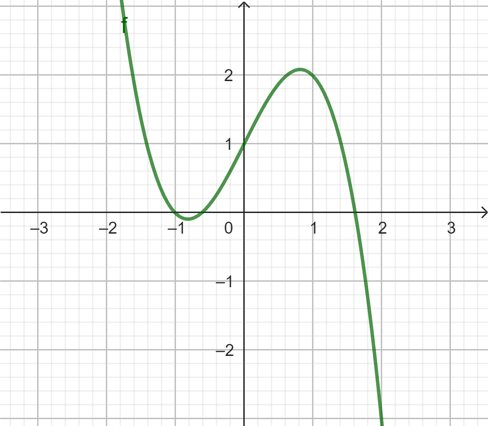
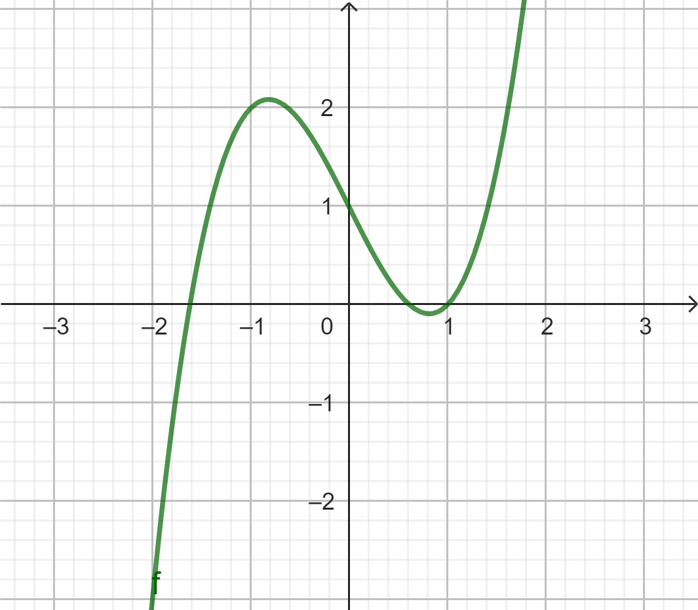
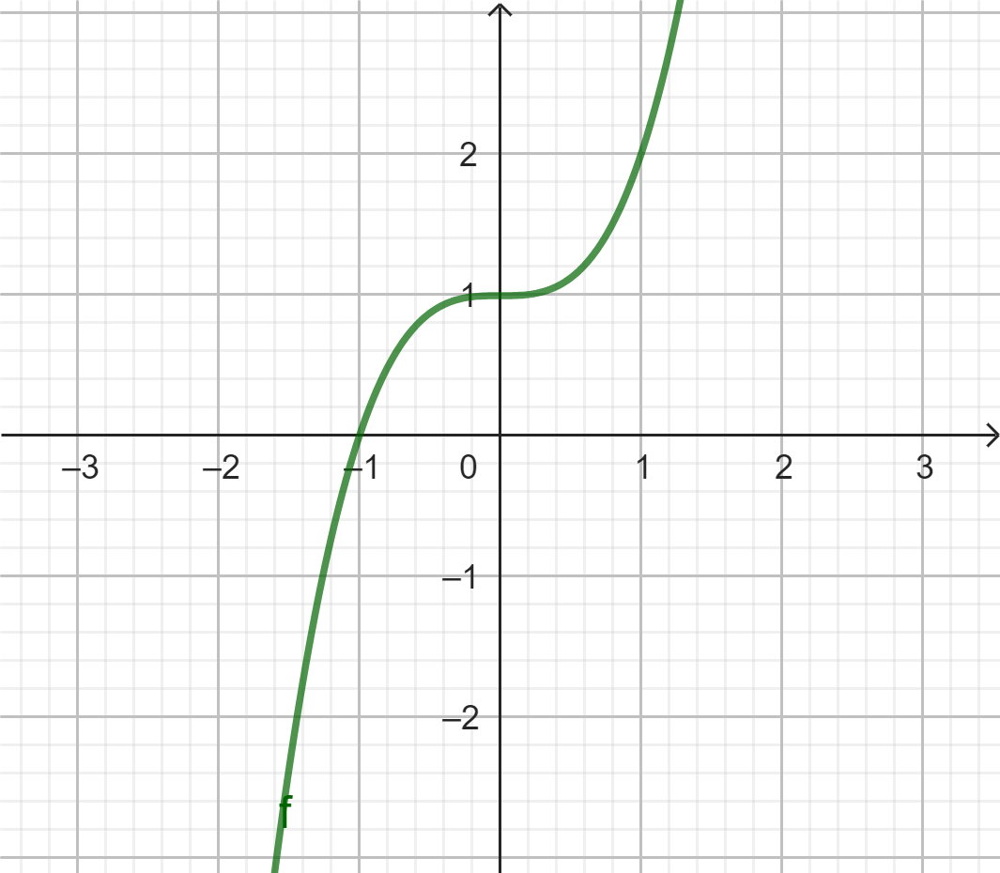
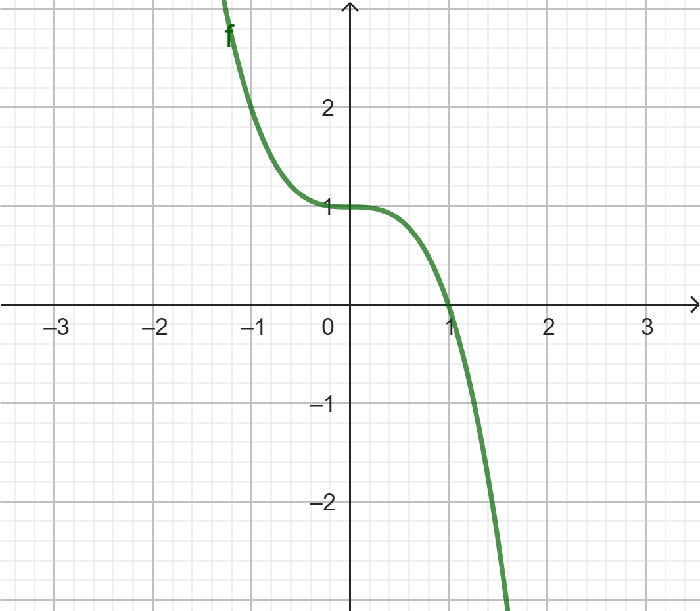
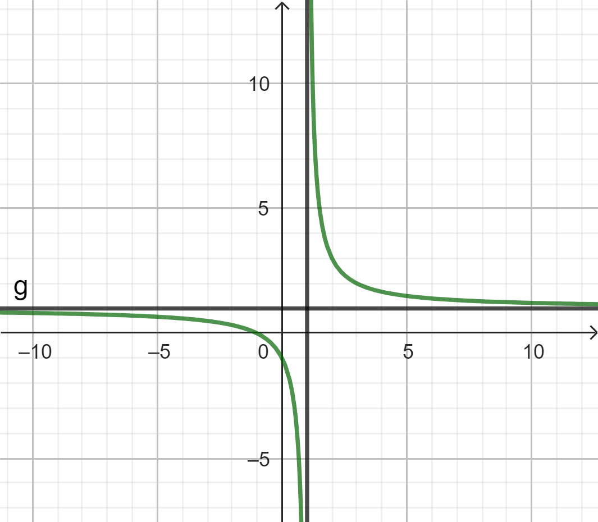
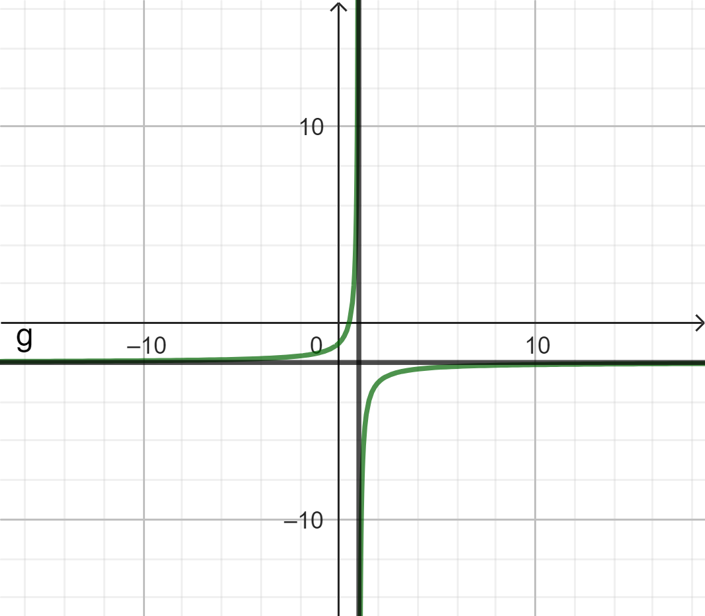
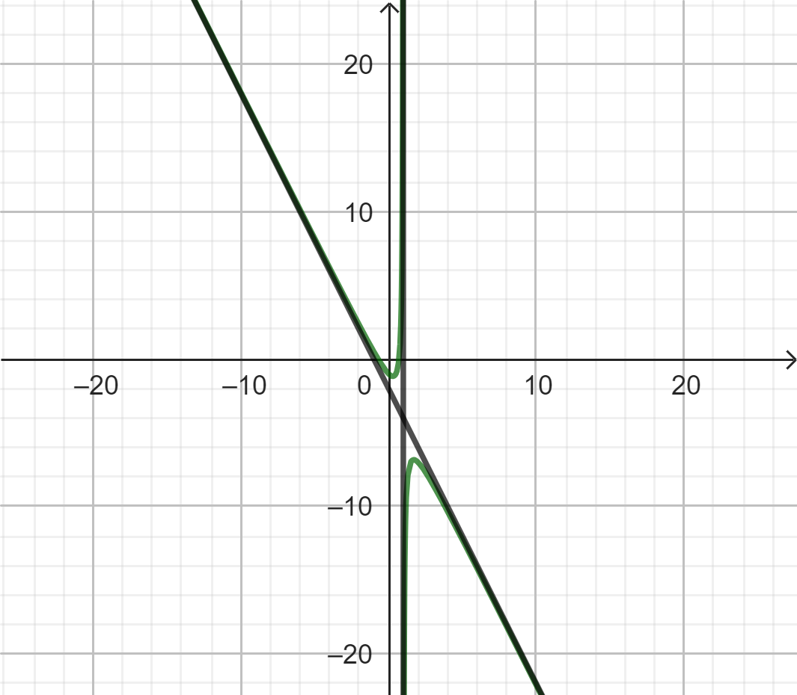
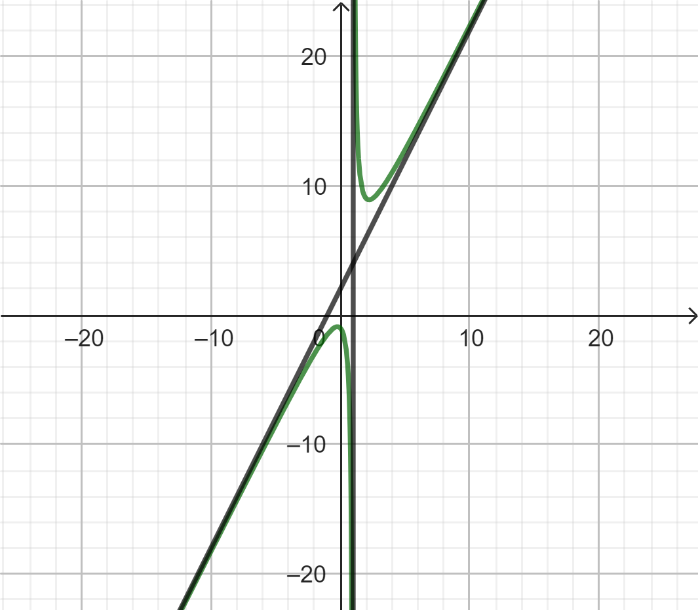
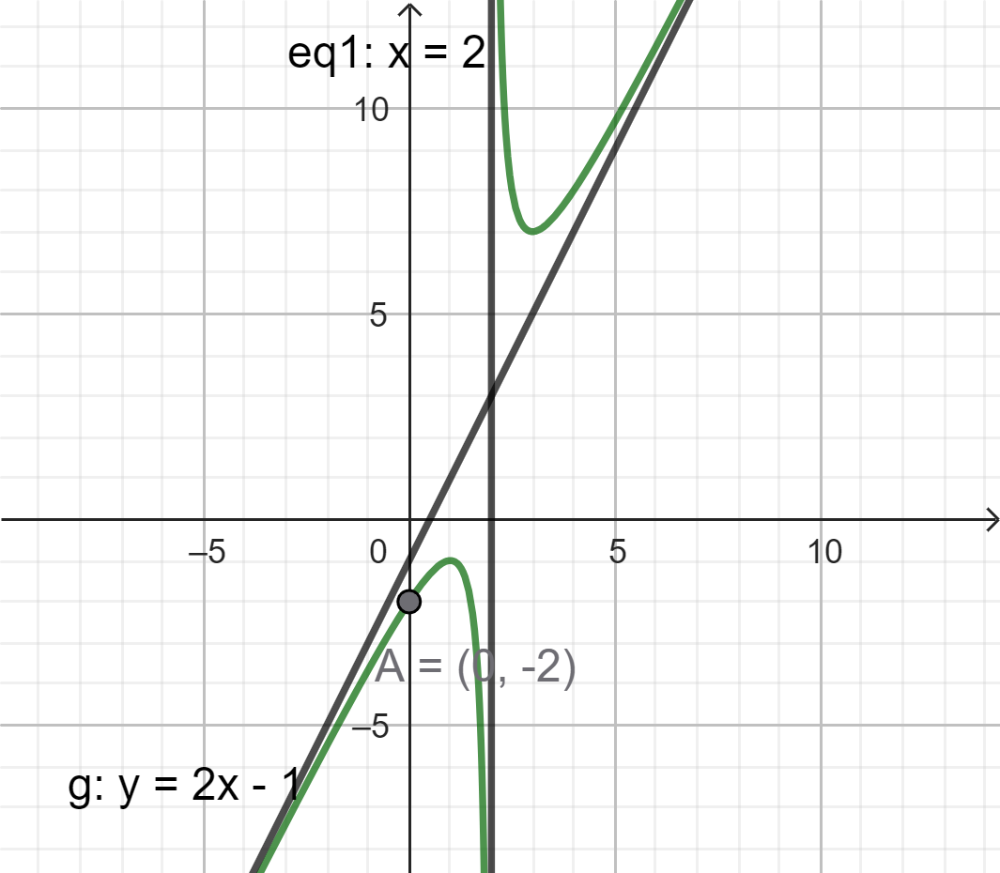

# Chương 1. Ứng dụng đạo hàm
## Bài 4. Khảo sát sự biến thiên và vẽ đồ thị của hàm số
### A. Lý thuyết
#### 1. Sơ đồ khảo sát hàm số
Các bước thực hiện:

1. Tìm tập xác định của hàm số

2. Khảo sát sự biến thiên của hàm số 

    - Tính đạo hàm $y'$. Tìm các điểm tại đó $y'=0$ hoặc đạo hàm không tồn tại.

    - Xét dấu $y'$ để chỉ ra các khoảng đơn điệu của hàm số. 

    - Tìm cực trị của hàm số.

    - Tìm các giới hạn tại vô cực, giới hạn vô cực và tìm tiệm cận của đồ thị hàm số (nếu có).

    -  Lập bảng biến thiên của hàm số.

3. Vẽ đồ thị của hàm số dựa vào bảng biến thiên

    - Chú ý: Khi vẽ đồ thị, nên xác định thêm một số điểm đặc biệt của đồ thị: 

    - Giao điểm của đồ thị với các trục tọa độ.

    - Trục đối xứng, tâm đối xứng (nếu có).

    - Giao điểm của đồ thị với các trục tọa độ.

    - Trục đối xứng, tâm đối xứng (nếu có).

    - Vẽ các đường tiệm cận của đồ thị hàm số (nếu có).

#### 2. Khảo sát và vẽ đồ thị hàm số đa thức bậc 3: $y=ax^3=bx^2+cx+d (a\neq 0)$

- Tập xác định $D=R.$

- $y'=3ax^2+2bx+c$

- Xét dấu $y'$ có 3 trường hợp: 

| có 2 nghiệm | có nghiệm kép | vô nghiệm |
|-------------|---------------|------------|
| 2 cực trị | 0 cực trị | không có cực trị |

- Kết luận cực trị (nếu có)

- Tìm giới hạn tại vô cực

- Lập bảng biến thiên

- Đồ thị: Có 4 dạng chính sau: ngã ngược, ngã xuôi, đi lên từ trái qua phải; đi xuống từ trái qua phải

|{: width="200"}|{: width="200"}|
|---|---|
|{: width="200"}|{: width="200"}|

- Đồ thị có tâm đối xứng là điểm uốn có hoành độ thỏa mãn $y''=0$ tức là $x=\frac{-b}{3a}.$

- Không có tiệm cận

### 3. Khảo sát và vẽ đồ thị hàm số phân thức hữu tỉ
#### 3.1. Dạng $y=\frac{ax+b}{cx+d}$. 

- $D=R\setminus\\{x=\frac{-d}{c}\\}.$

- Có tiệm cận đứng $x=\frac{-d}{c}$ và tiệm cận ngang $y=\frac{a}{c}.$

- Chỉ đồng biến hoặc nghịch biến.

- Có tâm đối xứng $I(\frac{-d}{c};\frac{a}{c}).$

|{: width="200"}|{: width="200"}|
|---|---|

#### 3.2. Dạng $y=\frac{ax^2+bx+c}{dx+e}.$

- Có tiệm cận đứng ($x=\frac{-e}{d}$) và tiệm cận xiên ($y=\dfrac{a}{d}x+\dfrac{b-\dfrac{ae}{d}}{d}$).

- Có tâm đối xứng là giao của 2 tiệm cận.

- Nhận hai đường phân giác của các góc tạo bởi 2 đường tiệm cận làm trục đối xứng.

|{: width="200"} |{: width="200"}|
|---|---|

### B. Các dạng bài tập thường gặp

#### Dạng 1. Khảo sát hàm số bậc ba

**Phương pháp:**

Cho hàm số $y = ax^3 + bx^2 + cx + d$ $(a \neq 0)$

**Bước 1:** Tập xác định: $D = \mathbb{R}$

**Bước 2:** Khảo sát sự biến thiên của hàm số

- **Giới hạn:**
  - Với $a > 0$ thì $\lim_{x \to +\infty} y = +\infty$ và $\lim_{x \to -\infty} y = -\infty$
  - Với $a < 0$ thì $\lim_{x \to +\infty} y = -\infty$ và $\lim_{x \to -\infty} y = +\infty$

- **Đạo hàm và cực trị:**

  - $y' = 3ax^2 + 2bx + c$

  - Hàm số có hai điểm cực trị khi $y' = 0$ có hai nghiệm phân biệt $\Leftrightarrow \Delta' > 0$

  - Gọi $A(x_1; y_1); B(x_2; y_2)$ là hai điểm cực trị, theo định lý Viet:
    $$\begin{cases}
    x_1 + x_2 = -\frac{2b}{3a} \\\\
    x_1x_2 = \frac{c}{3a}
    \end{cases}$$
  - Hàm số không có cực trị khi $y' = 0$ vô nghiệm hoặc nghiệm kép $\Leftrightarrow \Delta' \leq 0$

- **Bảng biến thiên:** (Xem lại lý thuyết)

- **Đồ thị hàm số:**
  - Không có tiệm cận
  - Tâm đối xứng là điểm có hoành độ thỏa mãn $y'' = 0 \Leftrightarrow x = -\frac{b}{3a}$

#### Ví dụ 1.1.
**Khảo sát sự biến thiên và vẽ đồ thị của hàm số $y = f(x) = -x^3 + 3x^2 - 4$**

#### Ví dụ 1.2.
**Cho hàm số $y = ax^3 + bx^2 + cx + d$ có đồ thị như hình vẽ bên dưới. Hãy xác định dấu của các hệ số $a$, $b$, $c$ và $d$.**

{: width="200"}

#### Dạng 2. Khảo sát hàm số hữu tỉ bậc nhất trên bậc nhất

**Phương pháp:**

Cho hàm số $y = \dfrac{ax + b}{cx + d}$ $(c \neq 0)$

**Bước 1:** Tập xác định: $D = \mathbb{R} \setminus \left\\{-\frac{d}{c}\right\\}$

**Bước 2:** Khảo sát sự biến thiên của hàm số

- **Giới hạn và đường tiệm cận:**

  - **Tiệm cận ngang:** $\lim\limits_{x \to \pm \infty} y = \frac{a}{c}$

    - Vậy $y = \frac{a}{c}$ là tiệm cận ngang của đồ thị hàm số

  - **Tiệm cận đứng:** 

    - $\lim\limits_{x \to \left(-\frac{d}{c}\right)^-} y = +\infty$ và $\lim\limits_{x \to \left(-\frac{d}{c}\right)^+} y = -\infty$ hoặc: $\lim\limits_{x \to \left(-\frac{d}{c}\right)^-} y = -\infty$ và $\lim\limits_{x \to \left(-\frac{d}{c}\right)^+} y = +\infty$

    - Vậy $x = -\frac{d}{c}$ là tiệm cận đứng của đồ thị hàm số

- **Đạo hàm:** $y' = \frac{ad - bc}{(cx + d)^2}$

  - **Nếu $ad - bc > 0, \forall x \in D$:** Hàm số đồng biến trên các khoảng $(-\infty; -\frac{d}{c})$ và $(-\frac{d}{c}; +\infty)$

  - **Nếu $ad - bc < 0, \forall x \in D$:** Hàm số nghịch biến trên các khoảng $(-\infty; -\frac{d}{c})$ và $(-\frac{d}{c}; +\infty)$

- **Bảng biến thiên:** (Xem lại lý thuyết)

- **Đồ thị hàm số:**
  - Đồ thị luôn có giao điểm của hai đường tiệm cận làm tâm đối xứng
  - Tâm đối xứng của đồ thị hàm số là $I\left(-\frac{d}{c}; \frac{a}{c}\right)$

#### Ví dụ 2.1.
Khảo sát sự biến thiên và vẽ đồ thị của hàm số 

a) $y = \dfrac{x}{x+1}$

b) $y = \dfrac{2x+1}{x+1}$

#### Dạng 3. Khảo sát hàm số hữu tỉ bậc hai trên bậc nhất

**Phương pháp:**

Cho hàm số $y = \frac{ax^2 + bx + c}{dx + e}$ với $ad \neq 0$, $x \neq -\frac{e}{d}$ và tử số, mẫu số không có nghiệm chung.

Đưa về dạng: $y = \alpha x + \beta + \frac{\gamma}{dx + e}$ (chia đa thức)

**Bước 1:** Tập xác định: $D = \mathbb{R} \setminus \left\\{-\frac{e}{d}\right\\}$

**Bước 2:** Khảo sát sự biến thiên của hàm số

- **Giới hạn và đường tiệm cận:**
  - **Tiệm cận đứng:** $\lim\limits_{x \to \left(-\frac{e}{d}\right)^\pm} y = \pm\infty \Rightarrow x = -\frac{e}{d}$ là tiệm cận đứng
  - **Tiệm cận xiên:** $\lim\limits_{x \to \pm\infty} [y - (\alpha x + \beta)] = 0 \Rightarrow y = \alpha x + \beta$ là tiệm cận xiên

- **Đạo hàm $y'$:** $y' = \frac{\alpha(dx + e)^2 - \gamma d}{(dx + e)^2}$
  - Dấu của $y'$ phụ thuộc vào dấu của $g(x) = \alpha(dx + e)^2 - \gamma d$

- **Điều kiện có cực trị:**
  - Nếu phương trình $y' = 0$ vô nghiệm hoặc có nghiệm kép thì không có cực trị
  - Nếu phương trình $y' = 0$ có hai nghiệm phân biệt thì có hai cực trị

- **Bảng biến thiên**

- **Đồ thị hàm số:**
  - Tìm giao điểm của đồ thị với các trục tọa độ (nếu có)
  - Đồ thị hàm số có giao điểm $I$ của hai đường tiệm cận làm tâm đối xứng

**Nhận xét:**

* Đồ thị hàm số có giao điểm của hai đường tiệm cận làm tâm đối xứng
* Hàm số có cực đại và cực tiểu khi và chỉ khi $y' = 0$ có hai nghiệm phân biệt khác $-\frac{e}{d}$
* Trong trường hợp đồ thị có cực đại và cực tiểu, phương trình đường thẳng đi qua hai điểm cực trị là $y = \frac{2ax + b}{d}$
* Mọi tiếp tuyến tại điểm $M \in (C)$ cắt hai đường tiệm cận tại $A, B$ thì $M$ là trung điểm của $AB$
* Diện tích tam giác $IAB$ (với $I$ là giao điểm của hai tiệm cận) là hằng số
* Với mọi điểm $M \in (C)$, tích khoảng cách từ $M$ đến hai đường tiệm cận là hằng số
* Nếu từ điểm $E$ nằm trên một trong hai đường tiệm cận của $(C)$, chỉ vẽ được một tiếp tuyến duy nhất đến $(C)$ qua $E$

#### Ví dụ 3.1.
Khảo sát sự biến thiên và vẽ đồ thị của hàm số $y = \dfrac{2x^2 + 5x + 4}{x + 2}$ (H)

#### Ví dụ 3.2.
Khảo sát sự biến thiên và vẽ đồ thị của hàm số $y = \dfrac{x^2 + x - 2}{x + 1}$

### Dạng 4. Nhận dạng hàm số khi biết đồ thị - bảng biến thiên.
#### Ví dụ 4.1. 
Cho hàm số bậc ba $y=f(x)$ có đồ thị như hình bên dưới. Viết công thức của hàm số.

{: width="200"}

#### Ví dụ 4.2.
Cho hàm số $y=\dfrac{ax-1}{2x+b}$ có bảng biến thiên như hình bên dưới. Xác định $a$ và $b$.

|$x$| $-\infty$|$\\,$ | $-1$| $\\,$| $+\infty$|
|---|---|---|---|---|---|
|$y'$| $\,$| $-$| $\|\|$| $-$| $\,$|
|$y$| $-1$| $\searrow -\infty$ | $\|\|$| $+\infty\searrow$ | $-1$|

#### Ví dụ 4.3.
Cho hàm số hữu tỉ $y=\dfrac{2x^2+ax+b}{cx-2}$ có đồ thị như hình bên dưới. Viết công thức của hàm số.

{: width="200"}
