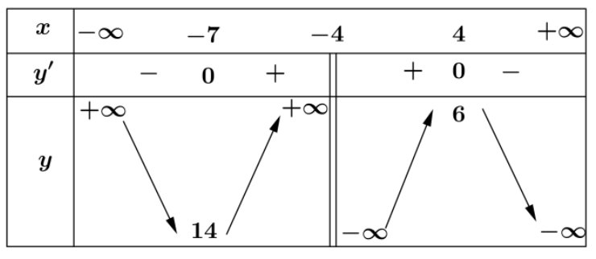
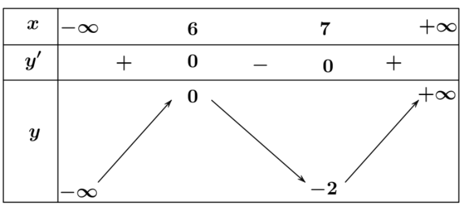
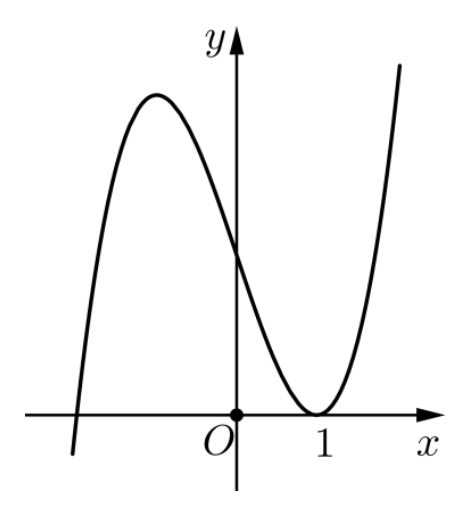
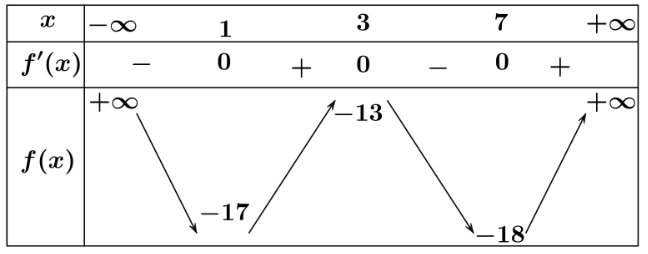
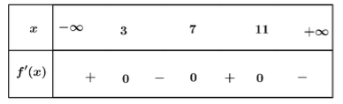
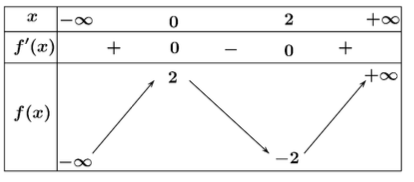
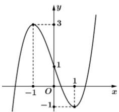

# Chương 1. Ứng dụng đạo hàm
## Bài 1. Tính đơn điệu và cực trị của hàm số

### Phần I: Câu hỏi trắc nghiệm (Mỗi câu hỏi yêu cầu học sinh chọn một phương án)

#### Câu 1
Cho hàm số $y = f(x)$ xác định với mọi $x \neq -4$ có bảng biến thiên như hình vẽ dưới đây. Hàm số đồng biến trên khoảng nào trong các khoảng sau?

Bảng biến thiên:

**Các phương án:**
- [ ] $(-7; + \infty)$
- [x] $(-7; -4)$ 
- [ ] $(6; + \infty)$
- [ ] $(-7; 4)$

#### Câu 2
Cho hàm số $y = f(x)$ xác định trên $\mathbb{R}$ và có bảng biến thiên như hình vẽ sau.

Tìm điểm cực đại của hàm số $y = f(x)$.

- [ ] $x = 7$
- [ ] $x = -2$
- [ ] $x = 0$
- [x] $x = 6$

#### Câu 3
Hàm số $y = \sqrt[3]{x^2}$ có tất cả bao nhiêu điểm cực trị?

**Các phương án:**
- [ ] 0
- [x] 1
- [ ] 2
- [ ] 3

#### Câu 4
Một vật có phương trình quãng đường tính theo thời gian là $s(t) = 5 + 8t - 2t^2$. Tại thời điểm nào, vật cách mốc tính quãng đường khoảng lớn nhất?

**Các phương án:**
- [ ] 1 giây
- [x] 2 giây
- [ ] 3 giây
- [ ] 4 giây

#### Câu 5
Cho hàm số $y = -\frac{x^3}{3} + x^2 + 4$. Hàm số đồng biến trên khoảng nào trong các khoảng sau đây?

- [ ] $(0; 2)$
- [x] $(-\infty; 0)\cup (2; +\infty)$
- [ ] $(0; +\infty)$
- [ ] $(-\infty; 0)$

#### Câu 6
Cho hàm số $y = \frac{2x + 8}{5x - 9}$. Hàm số nghịch biến trên khoảng nào trong các khoảng sau?

- [ ] $(-\infty; 5)$
- [ ] $(-\infty; +\infty)$
- [ ] $(0; +\infty)$
- [x] $(2; +\infty)$ ✓

#### Câu 7
Cho hàm số $y = \frac{-x^2 + 11x - 1}{x - 11}$. Hàm số nghịch biến trên khoảng nào trong các khoảng sau?

- [ ] $(-\infty; 11)$
- [ ] $(10; +\infty)$
- [ ] $(8; 15)$
- [x] $(-\infty; 6)$

#### Câu 8
Cho hàm số $y = \frac{2x}{x^2 + 8}$. Hàm số nghịch biến trên khoảng nào trong các khoảng sau?

- [ ] $(-6; +\infty)$
- [ ] $(-2\sqrt{2}; +\infty)$
- [ ] $(-\infty; 7)$
- [x] $(-\infty; -2\sqrt{2})$

#### Câu 9
Cho hàm số $y = f(x)$ là hàm số bậc ba có đồ thị là đường cong trong hình dưới đây. Hàm số đã cho đồng biến trên khoảng nào dưới đây?

- [x] $(1; +\infty)$
- [ ] $(0; 1)$
- [ ] $(-\infty; 2)$
- [ ] $(-\infty; 0)$

#### Câu 10
Một vật dao động có phương trình là $x(t) = 2\sin\left(\frac{\pi}{2}t - \frac{\pi}{3}\right)$ cm, $t$ có đơn vị là giây. Mệnh đề nào sau đây đúng? Trong khoảng 2 giây đến 3 giây, vận tốc của vật tăng hay giảm?

- [ ] Trong khoảng 2 giây đến 3 giây, vận tốc của vật không đổi.
- [ ] Trong khoảng 2 giây đến 3 giây, vận tốc của vật luôn tăng.
- [ ] Trong khoảng 2 giây đến 3 giây, vận tốc của vật luôn giảm.
- [x] Trong khoảng 2 giây đến 3 giây, vận tốc của vật giảm, sau đó tăng.

#### Câu 11
Cho hàm số $y = \frac{2x^2 - 2x + 2}{x - 1}$. Giá trị cực tiểu của hàm số đã cho là

- [x] 6
- [ ] -2
- [ ] 0
- [ ] 2

#### Câu 12
Cho hàm số $y = f(x) = x^3 - \frac{21x^2}{2} + 36x - 1$. Điểm cực tiểu của hàm số đã cho là

- [ ] $x = 8$
- [x] $x = 4$
- [ ] $x = 1$
- [ ] $x = 3$

## Phần II: Câu trắc nghiệm đúng sai

#### Câu 1
Cho hàm số $y = f(x)$ xác định trên $\mathbb{R}$ và có bảng biến thiên như hình vẽ. Xét tính đúng sai của các khẳng định sau:

**Các khẳng định:**
- [T] Hàm số đồng biến trên khoảng $(7;+\infty)$.
- [T] $f(1) < f(3)$.
- [F] Hàm số nghịch biến trên khoảng $(1;7)$.
- [F] Phương trình $f'(3x-1)=0$ nhận $x = \frac{2}{3}$ làm nghiệm.

#### Câu 2
Cho hàm số $y = \frac{2x+1}{-x+1}$. Xét tính đúng sai của các khẳng định sau:

- [T] Hàm số đồng biến trên khoảng $(-\infty; 1)$
- [F] Hàm số nghịch biến trên khoảng $(2; +\infty)$
- [T] Hàm số đồng biến trên khoảng $(2025; 2029)$
- [F] Hàm số đồng biến trên $\mathbb{R} \setminus \{1\}$

#### Câu 3
Cho hàm số $y = f(x)$ xác định trên $\mathbb{R}$ và có bảng xét dấu của $f'(x)$ như hình vẽ. Xét tính đúng sai của các khẳng định sau:

- [T] Điểm cực tiểu của hàm số đã cho là $x = 7$
- [F] $f(7)$ là giá trị cực đại của hàm số đã cho
- [F] Hàm số đồng biến trên khoảng $(7;+\infty)$
- [T] $f(11) > f(7)$

#### Câu 4
Cho hàm số $y = f(x)$ xác định và liên tục trên $\mathbb{R}$ có bảng biến thiên như hình vẽ dưới đây. Xét tính đúng sai của các khẳng định sau:

- [T] Hàm số $y = f(x)$ đồng biến trên khoảng $(-\infty;0)$ và $(2;+\infty)$
- [F] Hàm số $g(x) = 2x-3f(x)$ nghịch biến trên khoảng $(0;2)$
- [F] $f(\sin^2x) < f(\frac{3}{2})$
- [F] Hàm số $y = f(2-3x)$ nghịch biến trên khoảng $(0;2)$

## Phần III: Câu trắc nghiệm trả lời ngắn

#### Câu 1
Cho hàm số $y = f(x) = \frac{2x^2 + 26x + 18}{x + 13}$ có cực tiểu tại $x = x_1$ và cực đại tại $x = x_2$. Tính $P = -2x_1 + x_2$.

Đáp án: 4.

#### Câu 2
Có bao nhiêu giá trị nguyên của $m$ để hàm số $y = \frac{mx - 3}{2x - m}$ đồng biến trên mỗi khoảng xác định của nó?

Đáp án: 5.

#### Câu 3
Cho hàm số $y = f(x)$ có đạo hàm $y = f'(x)$ liên tục trên $\mathbb{R}$ và có đồ thị như hình vẽ dưới đây. Hàm số $y = f(x)$ có bao nhiêu khoảng đồng biến?

Đáp án: 2.

#### Câu 4
Một công ty du lịch tổ chức một chuyến đi. Giá ban đầu là 5 triệu đồng/khách cho 30 khách. Từ khách thứ 31 trở đi, cứ mỗi khách thêm thì giá giảm $a$ nghìn đồng (với $a$ là số nguyên dương). Số khách thêm tối đa là 15. Biết rằng nếu công ty nhận từ 1 đến 8 khách thêm thì tổng doanh thu tăng theo số khách thêm. Tìm giá trị nguyên lớn nhất có thể của $a$.

Đáp án: 108.

#### Câu 5
Tìm $m$ để hàm số $y = \frac{1}{3}x^3 - (m+1)x^2 + (m^2 + 2m)x - 3$ nghịch biến trên khoảng $(-1;1)$.

Đáp án: -1.

#### Câu 6
Kính viễn vọng không gian Hubble được đưa vào vũ trụ ngày 24/4/1990 bằng tàu con thoi Discovery. Vận tốc của tàu con thoi trong sứ mệnh này, từ lúc cất cánh tại thời điểm $t = 0$ (s) cho đến khi tên lửa đẩy được phóng đi tại thời điểm $t = 126$ (s) cho bởi hàm số sau đây:

$v(t) = 0,001302t^3 - 0,09029t^2 + 23$ (v đo bằng ft/s, 1 foot = 0,3048 m)

Gọi $(a;b)$ là khoảng thời gian gia tốc của tàu con thoi sẽ tăng tính từ thời điểm cất cánh cho đến khi tên lửa đẩy được phóng đi. Tính $T = a + b$?

Đáp án: 149.
