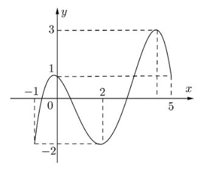
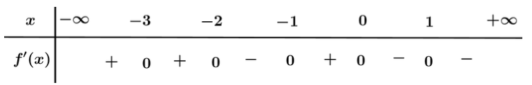
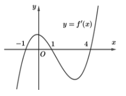

# Chương 1. Ứng dụng hàm số
## Bài 2. Max - Min của hàm số

### PHẦN I. Câu trắc nghiệm nhiều phương án lựa chọn. Mỗi câu hỏi thí sinh chỉ chọn một phương án.

#### Câu 1
Hàm số $y = (4-x^2)^2 + 1$ có giá trị lớn nhất trên đoạn $[-1;1]$ là

- [ ] A. 10.

- [ ] B. 12.

- [ ] C. 14.

- [x] D. 17.

#### Câu 2
Giá trị lớn nhất của hàm số $y = x + \frac{4}{x}$ trên đoạn $[1;3]$ bằng

- [ ] A. $\max\limits_{x \in [1;3]} y = 3$.

- [ ] B. $\max\limits_{x \in [1;3]} y = 4$.

- [x] C. $\max\limits_{x \in [1;3]} y = 5$.

- [ ] D. $\max\limits_{x \in [1;3]} y = 6$.

#### Câu 3
Cho hàm số $f(x)$ liên tục trên $[-1;5]$ và có đồ thị trên đoạn $[-1;5]$ như hình vẽ bên dưới. Tổng giá trị lớn nhất và giá trị nhỏ nhất của hàm số $f(x)$ trên đoạn $[-1;5]$ bằng

- [ ] A. -1

- [ ] B. 4

- [x] C. 1

- [ ] D. 2

#### Câu 4
Giá trị nhỏ nhất của hàm số $f(x) = x^3 - 3x + 2$ trên đoạn $[-3;3]$ là

- [ ]A. 20

- [x] B. -16

- [ ] C. 0

- [ ] D. 4

#### Câu 5
Cho hàm số $y = f(x)$ có bảng xét dấu đạo hàm như sau:
Giá trị lớn nhất của hàm số $y = f(x)$ trên khoảng $(-1;+\infty)$ là

- [ ] A. $f(1)$

- [ ] B. $f(-2)$

- [ ] C. $f(-1)$

- [x] D. $f(0)$

#### Câu 6
Gọi $M$ và $m$ lần lượt là giá trị lớn nhất và giá trị nhỏ nhất của hàm số $y = \frac{3\sin x + 2}{\sin x + 1}$ trên đoạn $\left[0; \frac{\pi}{2}\right]$. Giá trị của $M^2 + m^2$ bằng

- [ ] A. $\frac{31}{2}$

- [ ] B. $\frac{11}{2}$

- [x] C. $\frac{41}{4}$

- [ ] D. $\frac{61}{4}$

#### Câu 7
Một chất điểm chuyển động với vận tốc được cho bởi công thức $v(t) = -3t^2 + 12t + 1$ với $t$ (giây) là khoảng thời gian tính từ khi vật bắt đầu chuyển động. Hỏi sau bao lâu khi chất điểm chuyển động thì đạt được vận tốc lớn nhất?

- [x] A. 2(s).

- [ ] B. 1(s).

- [ ] C. 13(s).

- [ ] D. 4(s).

#### Câu 8
Một bể cá hình hộp chữ nhật có chiều cao 60cm và thể tích 96000cm³. Chi phí để làm kính các mặt bên là 70000 VNĐ/m², chi phí để làm kính mặt đáy là 100000 VNĐ/m². Chi phí thấp nhất để hoàn thành bể cá là

- [ ] A. 81200 VNĐ.

- [ ] B. 80200 VNĐ.

- [ ] C. 82200 VNĐ.

- [x] D. 83200 VNĐ.

#### Câu 9
Cho hàm số $y = \frac{x+m}{x+1}$ (m là tham số thực) thoả mãn $\min\limits_{[1;2]} y + \max\limits_{[1;2]} y = \frac{16}{3}$. Mệnh đề nào dưới đây đúng?

- [x] A. $m \gt 4$

- [ ] B. $2 \lt m \le 4$

- [ ] C. $m \le 0$

- [ ] D. $0 \lt m \le 2$

#### Câu 10
Cho hàm số $y = \frac{x+1}{x-m^2}$ (m là tham số thực) thỏa mãn $\min\limits_{[-3;-2]} y = \frac{1}{2}$. Mệnh đề nào dưới đây đúng?

- [ ] A. $3 < m \le 4$.

- [x] B. $-2 < m \le 3$.

- [ ] C. $m > 4$.

- [ ] D. $m \le -2$.

#### Câu 11
Một vật chuyển động theo quy luật $s(t) = -\frac{1}{3}t^3 + 6t^2$ với $t$ (giây) là khoảng thời gian tính từ lúc vật bắt đầu chuyển động và $s$ (mét) là quãng đường vật đi được trong khoảng thời gian đó. Hỏi trong khoảng thời gian 9 giây kể từ khi bắt đầu chuyển động, vận tốc lớn nhất của vật là bao nhiêu?

- [ ] A. $243(m/s)$

- [ ] B. $27(m/s)$

- [ ] C. $144(m/s)$

- [x] D. $36(m/s)$

#### Câu 12
Tìm các giá trị của tham số m để giá trị nhỏ nhất của hàm số $y = \frac{x-m^2+m}{x+1}$ trên đoạn $[0;1]$ bằng -2.

- [ ] A. $\begin{cases} m = -1 \\\ m = -2 \end{cases}$

- [ ] B. $\begin{cases} m = 1 \\\ m = 2 \end{cases}$

- [ ] C. $\begin{cases} m = 1 \\\ m = -2 \end{cases}$

- [x] D. $\begin{cases} m = -1 \\\ m = 2 \end{cases}$

### Câu 1
Cho đồ thị hàm số $y = f'(x)$ như hình vẽ bên dưới. Xét tính đúng sai của các khẳng định sau:

- [F] Hàm số $y = f(x)$ có hai cực trị.

- [F] Hàm số $y = f(x)$ đồng biến trên khoảng $(1;+\infty)$.

- [T] $f(1) \gt f(2) \gt f(4)$.

- [T] Trên đoạn $[-1;4]$ thì giá trị lớn nhất của hàm số $y = f(x)$ là $f(1)$.

### Câu 2
Cho hàm số $y = \dfrac{x-m^2-2}{x-m}$ (tham số $m$). Xét tính đúng sai của các khẳng định sau:

- [F] Tập xác định: $D = \mathbb{R}$.

- [T] Khi $m = 1$ hàm số đồng biến trên mỗi khoảng $(-\infty;1)$ và $(1;+\infty)$.

- [F] Khi $m = 1$ thì trên đoạn $[1;4]$ hàm số đạt giá trị lớn nhất bằng $\frac{1}{2}$.

- [T] Có 1 giá trị của tham số $m$ để giá trị lớn nhất của hàm số $y = \frac{x-m^2-2}{x-m}$ trên đoạn $[0;4]$ bằng $-1$.

### Câu 3
Cho hàm số $y = x^3 - 3mx^2 + 3(m^2-1)x + 2025$, (tham số $m$). Xét tính đúng sai của các khẳng định sau:

- [T] Khi $m = 1$ thì hàm số đạt cực tiểu tại $x = 2$.

- [F] Khi $m = 1$ thì hàm số đồng biến trên khoảng $(0;2)$.

- [T] Khi $m = 1$ thì hàm số có giá trị nhỏ nhất trên khoảng $(0;+\infty)$ bằng $-4$.

- [F] Có tất cả $1$ giá trị nguyên của $m$ để hàm số có giá trị nhỏ nhất trên khoảng $(0;+\infty)$.

### Câu 4
Một tàu đổ bộ tiến gần Mặt Trăng theo phương thẳng đứng và đốt cháy các tên lửa hãm ở độ cao ban đầu 250 km. Trong 50 giây đầu tiên kể từ khi đốt cháy các tên lửa hãm, độ cao $h$ (tính bằng km) của con tàu so với bề mặt Mặt Trăng được xấp xỉ bởi hàm số $h(t) = -0,01t^3 + 1,1t^2 - 30t + 250$, trong đó $t$ là thời gian (tính bằng giây). Xét tính đúng sai của các khẳng định sau:

- [T] Trong 50 giây đầu tiên, độ cao lớn nhất mà con tàu đạt được là 250 km.

- [F] Trong 50 giây đầu tiên, độ cao thấp nhất mà con tàu đạt được tại thời điểm $t \approx 25$ giây.

- [T] Trong 50 giây đầu tiên, vận tốc lớn nhất mà con tàu đạt được là 10,33 km/s.

- [F] Trong 50 giây đầu tiên, độ cao của con tàu khi vận tốc của nó đạt giá trị lớn nhất là 139,37 km.

### Câu 1
Gọi $m$ và $M$ lần lượt là giá trị nhỏ nhất và giá trị lớn nhất của hàm số $f(x) = \frac{1}{2}x - \sqrt{x+1}$ trên đoạn $[0;3]$. Tính $S = 2M - m$.

Đáp án: 0.

### Câu 2
Gọi $S$ là tập hợp tất cả các giá trị nguyên của tham số $m$ để giá trị lớn nhất của hàm số $f(x) = x^3 + (1+m^2)x + 1$ trên đoạn $[0;1]$ không vượt quá $7$. Số phần tử của tập hợp $S$ là

Đáp án: 5.

### Câu 3
Tìm giá trị nguyên của tham số $m$ để tổng giá trị lớn nhất và giá trị nhỏ nhất của hàm số $y = \frac{x+m}{x+1}$ trên đoạn $[1;2]$ bằng $8$.

Đáp án: 8.2.

### Câu 4
Một chất điểm chuyển động theo quy luật $S(t) = 6t^2 - t^3$ với $t$ (giây) là khoảng thời gian tính từ lúc vật bắt đầu chuyển động và $S$ (mét) là quãng đường vật đi được trong khoảng thời gian đó. Hỏi vận tốc của vật đạt giá trị lớn nhất tại thời điểm nào?

Đáp án: 2.

### Câu 5
Một cửa hàng có 8 máy in, mỗi máy in được 3600 bản in trong 1 giờ. Chi phí vận hành cho một máy in trong 1 giờ là 50 nghìn đồng. Chi phí vận hành cho $n$ máy in trong 1 giờ là $60(6n+10)$ nghìn đồng. Để in 50000 tờ quảng cáo, cửa hàng cần sử dụng bao nhiêu máy in để lợi nhuận là lớn nhất? (Biết $n$ là số nguyên và $1 \le n \le 8$).

Đáp án: 5.

### Câu 6
Ông Nam muốn xây một bể chứa nước mưa có dạng hình hộp chữ nhật với thể tích $V = 8$ m³. Biết rằng chiều dài của bể bằng $\frac{4}{3}$ lần chiều rộng. Đáy và nắp bể được xây bằng bê tông cốt thép, các mặt bên được xây bằng gạch và xi măng. Chi phí xây dựng trung bình là 980000 đồng/m². Nắp bể có một lỗ mở hình vuông có diện tích bằng $\frac{2}{9}$ diện tích nắp bể. Hỏi chi phí thấp nhất mà ông Nam phải chi trả là bao nhiêu? (Làm tròn đến triệu đồng).

Đáp án: 28.

