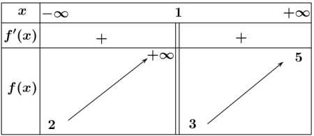
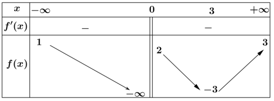
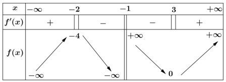
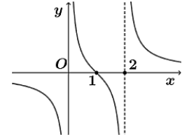

# Chương 1. Ứng dụng đạo hàm
## Bài 3. Tiệm cận của đồ thị hàm số

### PHẦN I. Câu trắc nghiệm nhiều phương án lựa chọn
*Mỗi câu hỏi thí sinh chỉ chọn một phương án.*

#### Câu 1
Tiệm cận ngang của đồ thị hàm số $y = \frac{3x+1}{x-1}$ có phương trình:

- [ ] $y = \frac{1}{3}$  
- [x] $y = 3$  
- [ ] $y = -1$  
- [ ] $y = 1$

#### Câu 2
Tiệm cận đứng của đồ thị hàm số $y = \frac{2x-2}{x+1}$ là đường thẳng nào sau đây?

- [ ] $x = -2$  
- [ ] $x = 1$  
- [x] $x = -1$  
- [ ] $x = 2$

#### Câu 3
Cho hàm số $y = f(x)$ có $\lim\limits_{x \to +\infty} f(x) = 1$ và $\lim\limits_{x \to -\infty} f(x) = -1$. Khẳng định nào sau đây là khẳng định đúng?

- [ ] Đồ thị hàm số đã cho có hai tiệm cận ngang là các đường thẳng $x = 1$ và $x = -1$.  
- [ ] Đồ thị hàm số đã cho không có tiệm cận ngang.  
- [ ] Đồ thị hàm số đã cho có đúng một tiệm cận ngang.  
- [x] Đồ thị hàm số đã cho có hai tiệm cận ngang là các đường thẳng $y = 1$ và $y = -1$.

#### Câu 4
Cho hàm số $y = f(x)$ có bảng biến thiên như sau. Tổng số đường tiệm cận ngang và đường tiệm cận đứng của đồ thị hàm số đã cho là:

- [x] 3  
- [ ] 2  
- [ ] 4  
- [ ] 1

#### Câu 5
Hàm số nào sau đây có một tiệm cận:

- [ ] $y = \dfrac{x+3}{2x-1}$  
- [ ] $y = \dfrac{x^2 + 3x - 2}{x+3}$  
- [ ] $y = \dfrac{4}{x-1}$  
- [x] $y = \dfrac{2x}{x^2 + 1}$

#### Câu 6
Cho hàm số $y = f(x)$ có bảng biến thiên như sau. Tổng số tiệm cận đứng và tiệm cận ngang của đồ thị hàm số đã cho là:

- [ ] 2  
- [x] 3  
- [ ] 4  
- [ ] 1

#### Câu 7
Đường thẳng $2y + 1 = 0$ là tiệm cận ngang của hàm số nào sau đây?

- [ ] $y = \frac{x+1}{2x+1}$  
- [ ] $y = \dfrac{x^2 + x + 1}{1-2x}$  
- [ ] $y = \dfrac{2x+1}{1-x}$  
- [x ] $y = \dfrac{3-x^2}{2x^2 - 3x + 1}$

#### Câu 8
Cho hàm số $y = 2x - 1 + \dfrac{3}{x+3} \ (C)$. Khoảng cách từ $M(2; -1)$ đến tiệm cận xiên của đồ thị $(C)$ là:

- [ ] $\dfrac{2}{\sqrt{5}}$  
- [x] $\dfrac{4}{\sqrt{5}}$  
- [ ] 2  
- [ ] 4

#### Câu 9
Với giá trị nào của $m$ thì tiệm cận xiên của đồ thị hàm số $y = x + m + \dfrac{3}{m-x}$ đi qua điểm $M(1;2)$

- [x] $m = 1$  
- [ ] $m = 0$  
- [ ] $m = 2$  
- [ ] Một đáp án khác.

#### Câu 10
Đồ thị hàm số $y = \dfrac{2x^2 - 3x + m}{x-m}$ là $(C_m)$. Giá trị của $m$ để đồ thị hàm số $(C_m)$ không có tiệm cận đứng là:

- [ ] $m = 0$  
- [ ] $m = 1$  
- [x] $m = 0$ hoặc $m = 1$  
- [ ] $m = 0$ hoặc $m = -1$.

#### Câu 11
Cho hàm số $y = \frac{mx^2 + 6x - 2}{x+2}$ có đồ thị $(C_m)$. Với giá trị nào của $m$ thì đồ thị hàm số $(C_m)$ có tiệm cận đứng và không có tiệm cận xiên.

- [x] $m = \frac{7}{2}$  
- [ ] $m = \frac{3}{2}$  
- [ ] $m = 2$  
- [ ] $m = 0$

#### Câu 12
Tại một công ty sản xuất đồ chơi $A$, công ty phải chi $50000$ USD để thiết lập dây chuyền sản xuất ban đầu. Sau đó, cứ sản xuất được một sản phẩm đồ chơi $A$, công ty phải chi trả $5$ USD cho nguyên liệu thô và nhân công. Gọi $x \ (x \geq 1)$ là số đồ chơi $A$ mà công ty đã sản xuất và $T(x)$ (đơn vị USD) là tổng số tiền bao gồm cả chi phí ban đầu mà công ty phải chi trả khi sản xuất $x$ đồ chơi $A$. Người ta xác định chi phí trung bình cho mỗi sản phẩm đồ chơi $A$ là $M(x) = \frac{T(x)}{x}$.

Khi $x$ đủ lớn $(x \to +\infty)$ thì chi phí trung bình (USD) cho mỗi sản phẩm đồ chơi $A$ gần nhất với kết quả nào sau đây?

- [ ] $50000$  
- [ ] $50005$  
- [ ] $10$  
- [x] $5$

### PHẦN II. Câu trắc nghiệm đúng sai

#### Câu 1
Cho hàm số $y = f(x)$ có bảng biến thiên như hàm số dưới đây. Xét tính đúng sai của các khẳng định sau:

- [F] Hàm số đã cho nghịch biến trên khoảng $(-2; 0)$

- [F] Đồ thị hàm số đã cho có tiệm cận ngang

- [F] Đồ thị hàm số đã cho có hai đường tiệm cận đứng

- [F] Hàm số có giá trị lớn nhất trên $\mathbb{R}$

#### Câu 2
Cho hàm số có đồ thị như hình vẽ dưới đây. Xét tính đúng sai của các khẳng định sau:

- [T] Hàm số đã cho liên tục trên khoảng $(0; 2)$

- [T] Hàm số đã cho nghịch biến trên khoảng $(1; 2)$

- [T] Đồ thị hàm số đã cho không có đường tiệm cận ngang

- [T] Khoảng cách giữa hai đường tiệm cận đứng của đồ thị hàm số bằng $2$.

#### Câu 3
Cho hàm số $y = \frac{x^2 - 2x + 2}{x + 2}$ có đồ thị là $(C)$. Xét tính đúng sai của các khẳng định sau:

- [T] Đồ thị hàm số $(C)$ có hai đường tiệm cận.

- [T] Giao điểm của hai tiệm cận là $I(-2; -6)$.

- [F] Khoảng cách từ $O$ đến tiệm cận xiên bằng $4\sqrt{2}$.

- [T] Đường tiệm cận xiên của đồ thị hàm số $(C)$ đi qua điểm $M(0; -4)$.

#### Câu 4
Cho hàm số $y = \frac{x^2 + mx - 1}{x - 1} \ (C_m) \ (m \text{ là tham số})$. Xét tính đúng sai của các khẳng định sau:

- [T] Để đồ thị $(C_m)$ của hàm số có tiệm cận xiên thì $m \neq 0$.

- [T] Để tiệm cận xiên của $(C_m)$ đi qua $M(2; -5)$ thì $m = -8$.

- [F] Để tiệm cận xiên của $(C_m)$ tạo với hai trục tọa độ một tam giác có diện tích bằng $8$ (đvdt) thì tổng tất cả các giá trị $m$ tìm được bằng $2$.

- [F] Với $m = 3$ thì giao điểm của hai đường tiệm cận của $(C_m)$ nằm trên Parabol $y = x^2 + 3$.

### PHẦN III. Câu trắc nghiệm trả lời ngắn

#### Câu 1
Cho hàm số $y = \frac{2x + m}{mx - 1}$. Tổng các giá trị $m$ để đồ thị hàm số có tiệm cận đứng, tiệm cận ngang và các tiệm cận cùng với hai trục tọa độ tạo thành một hình chữ nhật có diện tích là $2$.

Đáp án: 0.

#### Câu 2
Chi phí để loại bỏ $x\%$ chất gây ô nhiễm là $C$ (nghìn đô) với $C(x) = \frac{12x}{100-x}$. Tính chi phí để loại bỏ $50\%$ chất gây ô nhiễm?

Đáp án: 12000.

#### Câu 3
Anh An là một nhà quy hoạch đô thị, mô hình hóa dân số $P(t)$ (nghìn người) của vùng anh ấy sống sau $t$ năm kể từ thời điểm hiện tại là $P(t) = \dfrac{40t}{t^2 + 10} - \dfrac{50}{t + 1} + 70$. Dân số mà anh An dự kiến trong dài hạn là bao nhiêu nghìn người (khi $t \to +\infty$).

Đáp án: 70.

#### Câu 4
Nồng độ thuốc trong máu của một bệnh nhân $t$ giờ sau khi tiêm là $C(t) \left[ \frac{mg}{ml} \right]$ với $C(t)$ được cho bởi công thức $C(t) = \frac{0.4}{t^2 + 1} + 0.013$. Tìm nồng độ thuốc tồn dư, tức là nồng độ thuốc vẫn còn trong cơ thể bệnh nhân trong dài hạn (khi $t \to +\infty$).

Đáp án: 0.013.

#### Câu 5
Hai loài cùng tồn tại trong cùng một hệ sinh thái. Sau $t$ năm, số lượng cá thể loài $I$ là $P(t)$ nghìn con, số lượng cá thể loài $II$ là $Q(t)$ nghìn con, trong đó $P$ và $Q$ được mô hình hóa bởi các hàm $Q(t) = \dfrac{64}{4 - t}$ với mọi $t \geq 0$ sao cho số lượng cá thể tương ứng là đại lượng không âm. Tìm số lượng cá thể ban đầu của mỗi loài $II$.

Đáp án: 16.

#### Câu 6
Cho hàm số $y = \frac{mx^2 + (m^2 + m + 2)x + m^2 + 3}{x + 1}$. Tìm $m \in \mathbb{R}$ để khoảng cách từ gốc $O$ đến tiệm cận xiên hoặc ngang là nhỏ nhất.

Đáp án: 2.

