# Chương 1. Ứng dụng đạo hàm
## Bài 4. Khảo Sát Sự Biến Thiên Và Vẽ Đồ Thị Hàm Số 

### Phần I: Câu Trắc Nghiệm Nhiều Phương Án Lựa Chọn

#### Câu 1:
Bảng biến thiên dưới đây là của hàm số nào trong các hàm số sau?

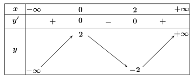

- [ ]  $y = -x^3 + 3x^2 - 3$  
- [ ] $y = x^3 + 3x^2 - 1$  
- [ ] $y = x^3 - 3x + 2$  
- [x] $y = -x^3 + 3x^2 + 2$

#### Câu 2:
Cho hàm số $y = \frac{ax + b}{cx - 1}$ có đồ thị như hình vẽ bên dưới. Giá trị của tổng $S = a + b + c$ bằng:

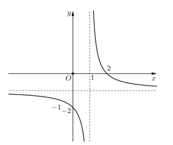

- [ ] $S = 0$  
- [ ] $S = -2$  
- [x] $S = 2$  
- [ ] $S = 4$

#### Câu 3:
Đường cong trong hình bên là đồ thị của một hàm số trong bốn hàm số được liệt kê ở bốn phương án $ A, B, C, D $ dưới đây. Hỏi hàm số đó là hàm số nào?
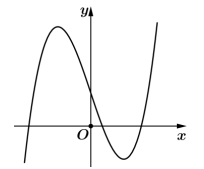

- [ ] $ y = x^3 - 3x - 1 $  
- [ ] $ y = x^3 - 3x^2 + 1 $  
- [ ] $ y = -x^3 + 3x + 1 $  
- [x] $ y = x^3 - 3x + 1 $

#### Câu 4:
Cho hàm số $ f(x) = \frac{ax - 6}{bx - c} $ có bảng biến thiên như sau. Trong các số $ a, b, c $ có bao nhiêu số âm?

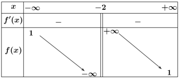

- [ ] 3  
- [ ] 1  
- [x] 2  
- [ ] 0

#### Câu 5:
Đồ thị ở hình bên là của một trong bốn hàm số sau. Hỏi đó là hàm số nào trong các hàm số sau?

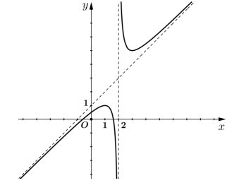

- [x] $ y = \frac{x^2 - x - 1}{x - 2} $  
- [ ] $ y = \frac{x^2 + x - 1}{x - 2} $  
- [ ] $ y = \frac{x^2 - 2x - 1}{x - 2} $  
- [ ] $ y = \frac{x^2 - x + 1}{x - 2} $

#### Câu 6:
Cho hàm số $ y = ax^3 + bx^2 + cx + d $ $ (a, b, c, d \in \mathbb{R}) $ có đồ thị là đường cong trong hình bên. Có bao nhiêu số dương trong các số $ a, b, c, d $?

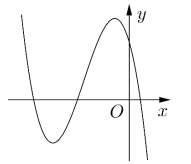

- [ ] 4  
- [ ] 2  
- [x] 1  
- [ ] 3

### Câu 7:
Trong các hàm số sau, hàm số nào có bảng biến thiên như hình vẽ dưới đây:

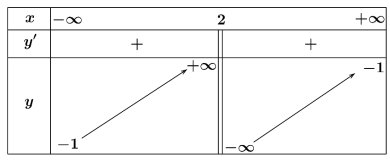

- [ ] $ y = \frac{x + 1}{x - 2} $  
- [ ] $ y = \frac{x + 3}{x - 2} $  
- [x] $ y = \frac{x - 1}{x - 2} $  
- [ ] $ y = \frac{x - 3}{x - 2} $

### Câu 8:
Một bể chứa ban đầu có 100 lít nước. Sau đó, cứ mỗi phút người ta bơm thêm 20 lít nước, đồng thời cho vào bể 10 gam chất khử trùng (hoà tan). Hàm số $ f(t) $ thể hiện nồng độ chất khử trùng (gam/lit) trong bể sau $ t $ phút là:

- [ ] $ f(t) = \frac{20t + 100}{10t} $  
- [ ] $ f(t) = 20t + 100 $  
- [x] $ f(t) = \frac{10t}{20t + 100} $  
- [ ] $ f(t) = 20,02t + 100 $

### Câu 9:
Hồ nuôi tôm giống của một anh nông dân chứa 30 khối nước, cứ mỗi giờ máy bơm nước sẽ bơm thêm vào hồ 4 khối nước, đồng thời anh ta cũng thêm vào 3 kg bột xử lý nước. Nồng độ (kg/khối) của bột xử lý nước trong hồ không bao giờ vượt quá

 [ ] 12 (kg/khối)  
 [ ] 1,33 (kg/khối)  
 [ ] 1,25 (kg/khối)  
 [x] 0,75 (kg/khối)

### Câu 10:
Cho hàm số $ y = \frac{x^2 - mx + 2m}{x + m} $ có đồ thị $ C_m $. Có tất cả bao nhiêu đồ thị $ C_m $ đi qua điểm $ (0;1) $?

- [ ] 1  
- [ ] 2  
- [x] 0  
- [ ] 3

### Câu 11:
Cho hàm số $ y = \frac{ax + b}{cx + 1} $ $ (a,b,c \in \mathbb{R}) $ có bảng biến thiên như trong ảnh.
Tập các giá trị $ b $ là tập nghiệm của bất phương trình nào dưới đây?

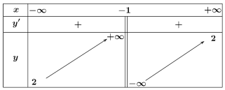

- [ ] $ b^3 - 8 \leq 0 $  
- [ ] $ -b^2 + 4 > 0 $  
- [ ] $ b^2 - 3b + 2 < 0 $  
- [x] $ b^3 - 8 < 0 $

### Câu 12:
Tất cả giá trị của tham số $ m $ để đồ thị hàm số $ y = x^3 + (m^2 - 2)x + 2m^2 + 4 $ cắt các trục tọa độ $ Ox, Oy $ lần lượt tại $ A, B $ sao cho diện tích tam giác $ OAB $ bằng 8 là

- [ ] $ m = \pm 2 $  
- [ ] $ m = \pm 1 $  
- [ ] $ m = \pm \sqrt{3} $  
- [x] $ m = \pm \sqrt{2} $

### Phần II: Câu Trắc Nghiệm Đúng Sai

#### Câu 1:
Cho hàm số $ y = f(x) = x^3 - 6x^2 - 15x + 20 $. Xét tính đúng sai của các khẳng định sau:

- [T] Đồ thị hàm số $ y = f(x) $ cắt trục tung tại điểm có tung độ bằng 20
- [F] Hàm số đồng biến trên khoảng $(-\infty; -1) \cap (5;+\infty)$
- [T] Điểm uốn của đồ thị hàm số có tọa độ $ I(2;-26) $
- [T] Giá trị nhỏ nhất của hàm số $ f(x) $ trên khoảng $(-4;+\infty) $ bằng $-80$

### Câu 2:
Cho hàm số $ y = 2x^3 + (m - 1)x^2 + (m + 2)x + 1 $. Xét tính đúng sai của các khẳng định sau:

- [T] Khi $ m = 1 $ đồ thị hàm số cắt trục hoành tại 1 điểm phân biệt
- [T] Đồ thị hàm số luôn đi qua điểm $ A(0;1) $
- [F] Phương trình tiếp tuyến của đồ thị hàm số song song với đường thẳng $ y = 9x - 3 $ đi qua điểm $ B(1;5) $
- [F] Có 1 giá trị nguyên của tham số $ m $ để đồ thị hàm số có điểm cực đại và điểm cực tiểu có hoành độ lớn hơn $ \frac{1}{6} $.

#### Câu 3:
Cho hàm số $ y = \frac{3x + 2}{x + 2} $ có đồ thị là $ C $. Xét tính đúng sai của các khẳng định sau:

- [F] Đường thẳng $ y = 3 $ là tiệm cận đứng của đồ thị hàm số $ C $.  
- [T] Điểm $ I(-2;3) $ là giao điểm của các đường tiệm cận của đồ thị $ C $.  
- [T] Đồ thị $ C $ cắt đường thẳng $ y = x + 2 $ tại hai điểm phân biệt  
- [T] Đường thẳng $ y = x $ cắt $ C $ tại hai điểm $ A, B $. Biết đường thẳng $ y = x + k $ cắt $ C, D $ thì $ ABCD $ là hình bình hành khi đó $ k > 5 $

#### Câu 4:
Cho hàm số $ y = \frac{-x^2 - 3x + 4}{x - 3} $ có đồ thị là $ C $. Xét tính đúng sai của các khẳng định sau:

- [T] Đồ thị $ C $ có tiệm cận xiên là $ y = -x - 6 $.  
- [T] Đồ thị $ C $ nhận giao điểm $ I(3;-9) $ làm tâm đối xứng.  
- [T] Đồ thị $ C $ có hai điểm cực trị nằm 2 phía đối với $ Oy $.  
- [F] Đồ thị $ C $ không cắt trục $ Ox $.

### Phần III: Câu Trắc Nghiệm Trả Lời Ngắn

#### Câu 1:
Gọi $ S $ là tập hợp các giá trị $ m $ để tiệm cận xiên của đồ thị hàm số $ y = \frac{mx^2 + x - 3}{x - 1} $ tạo với hai trục hệ tọa độ $ Oxy $ một tam giác có diện tích bằng 2. Khi đó tổng các giá trị của $ S $ bằng bao nhiêu?

Đáp án: -5.5

#### Câu 2:
Nếu trong một ngày, một xưởng sản xuất được $ x $ chiếc vợt cầu lông thì chi phí trung bình (tính bằng nghìn đồng) cho một chiếc vợt cầu lông được cho bởi công thức $ C(x) = \frac{5x + 1}{x} $. Xét trong một khoảng thời gian dài, xưởng sản xuất đã sản xuất được "rất nhiều" chiếc vợt cầu lông. Vậy cho đến nay, chi phí sản xuất mỗi chiếc vợt cầu lông là bao nhiêu nghìn đồng?

Đáp án: 5.

#### Câu 3:
Cho một tấm nhôm hình vuông cạnh 12 cm. Người ta cắt ở bốn góc của tấm nhôm đó bốn hình vuông bằng nhau, mỗi hình vuông có cạnh bằng $ x $ (cm), rồi gấp tấm nhôm lại như hình vẽ dưới đây để được một cái hộp không nắp. Tìm $ x $ để hộp nhận được có thể tích lớn nhất.

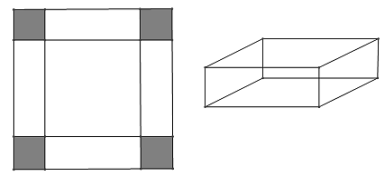

Đáp án: 2.

#### Câu 4:
Hình dưới đây là mương dẫn nước thủy lợi tại một địa phương phục vụ tưới tiêu cho ruộng đồng. Phần không gian trong mương để nước chảy có mặt cắt ngang là hình chữ nhật $ ABCD $. Với điều kiện lưu lượng nước qua mương cho phép thì diện tích mặt cắt $ ABCD $ là $ 0,48 \text{m}^2 $. Để đảm bảo yêu cầu kỹ thuật tốt nhất cho mương, người ta cần thiết kế sao cho tổng độ dài $ T = AB + BC + CD $ là ngắn nhất. Khi đó chiều rộng đáy mương bằng bao nhiêu (biết chiều rộng phải dưới 1m, làm tròn kết quả đến hàng phần trăm).

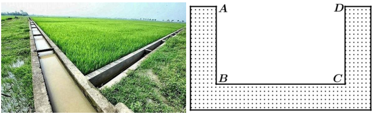

Đáp án: 0.98.

#### Câu 5:
Một cốc chứa 25 ml dung dịch NaOH với nồng độ 100 mg/ml. Một bình chứa dung dịch NaOH khác với nồng độ 9 mg/ml được trộn vào cốc. Gọi $ C(x) $ là nồng độ của NaOH sau khi trộn $ x $ (ml) từ bình chứa, ta thấy nồng độ của NaOH trong cốc sẽ luôn giảm theo $ x $ nhưng luôn lớn hơn một số $ a $. Tính $ a $?

Đáp án: 9.

#### Câu 6:
Trong tiết học Toán, giáo viên phát cho 4 tổ một tấm bìa hình vuông $ ABCD $ cạnh bằng 10 cm. Giáo viên yêu cầu 4 tổ sử dụng tấm bìa này và cắt tấm bìa theo các tam giác cân $ AEB, BFC, CGD, DHA $ để sau đó gấp các tam giác $ AEH, BEF, CFG, DGH $ sao cho bốn đỉnh $ A, B, C, D $ trùng nhau tạo thành khối chóp tứ giác đều. Khi đó thể tích lớn nhất của khối chóp tứ giác đều tạo thành bằng $ \frac{a\sqrt{b}}{c} $ $ \text{(cm}^3\text{)} $ với $ a,b,c $ là các số nguyên dương. Tính $ P = a + b + c $

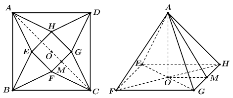

Đáp án: 45.
