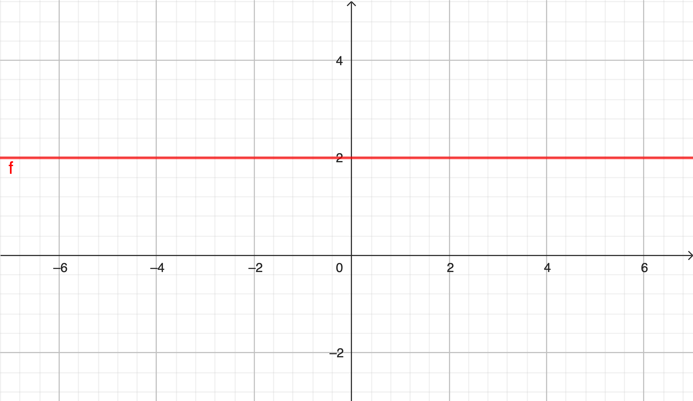
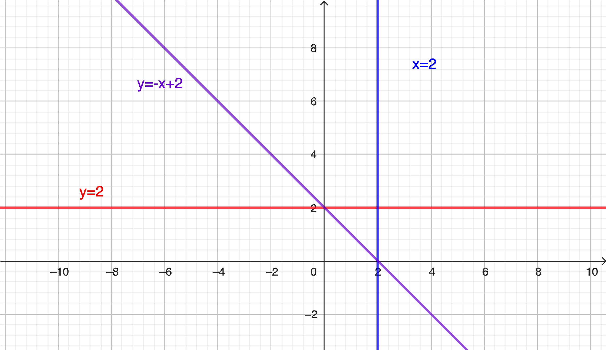

# Toán 9
## Chương I. Phương trình và hệ hai phương trình bậc nhất hai ẩn
### Bài 1. Khái niệm phương trình và hệ hai phương trình bậc nhất hai ẩn.
#### 1. Phương trình bậc nhất hai ẩn
*Định nghĩa:*
Phương trình bậc nhất hai ẩn có dạng: $$ax+by=c,$$ trong đó $$a^2+b^2>0$$

(điều kiện $$a\neq 0$$ hoặc $$b\neq 0$$ tương đương với $$a^2+b^2>0$$)

##### Trường hợp 1. $$a=0$$
- Phương trình $$ax+by=c$$ trở thành $$by=c$$ hay $$y=\frac{c}{b}$$.

- Tập nghiệm của phương trình $$\begin{cases} x\in \mathbb{R} \\
y= \frac{c}{b} \end{cases}$$ 

##### Trường hợp 2. $$b=0$$
- Phương trình $$ax+by=c$$ trở thành $$ax=c$$ hay $$x=\frac{c}{a}$$.

- Tập nghiệm của phương trình $$\begin{cases} x= \frac{c}{a} \\
y\in \mathbb{R} \end{cases}$$ 

##### Trường hợp 3. $$a\neq 0$$ và $$b\neq 0$$
- Phương trình $$ax+by=c$$ trở thành $$y=-\frac{a}{b}x+\frac{c}{b}$$.

- Tập nghiệm của phương trình $$\begin{cases} x\in \mathbb{R} \\
y=-\frac{a}{b}x+\frac{c}{b} \end{cases}$$ 

 Chú ý: Phương trình bậc nhất hai ẩn luôn có vô số nghiệm.

Ví dụ 2: Giả sử $$(x,y)$$ là nghiệm của phương trình bậc nhất hai ẩn $$x+2y=5.$$

a) Hoàn thành bảng sau:

| $x$ | $-2$ | $-1$ | $0$ | $x+2.1=5$ | $x+2.2=5$ |
|-----|-----|-----|-----|-----|-----|
| $y$ | $-2+2y=5$ | $-1+2y=5$ | $0+2y=5$ | $1$ | $2$ |
|| $2y=7$|$2y=6$|$2y=5$|$x+2=5$|$x+4=5$|
|| $$y=\dfrac{7}{2}$$|$$y=3$$| $$y=\dfrac{5}{2}$$|$$x=3$$| $$x=1$$|

 Rút ra được: Có $$x$$ thì sẽ tìm được $$y$$ và ngược lại.

b) Tính $$y$$ theo $$x$$. Từ đó cho biết phương trình đã cho có bao nhiêu nghiệm?

$$y=\dfrac{5-x}{2},$$ $$ x\in \mathbb{R}$$ nên phương trình đã cho có vô số nghiệm.

#### 2. Biểu diễn nghiệm của phương trình bậc nhất 2 ẩn.

##### Trường hợp 1. $$a=0$$
- Phương trình $$ax+by=c$$ trở thành $$by=c$$ hay $$y=\frac{c}{b}$$.

Ví dụ: Với $$b=1, c= 2$$ thì $$y=2$$. Nghiệm của phương trình $$0x+y=2$$ có dạng $$(x_0,2)$$, các điểm có toạ độ $$(x_0,2)$$ biểu diễn trên mặt phẳng $$(Oxy)$$ là đường thẳng $$y=2$$ song song với trục hoành ($$Ox$$) và cắt trục tung ($$Oy$$) tại điểm $$(0,2)$$.

 

##### Trường hợp 2. $$b=0$$
- Phương trình $$ax+by=c$$ trở thành $$ax=c$$ hay $$x=\frac{c}{a}$$.

Ví dụ: Với $$a=1, c= 2$$ thì $$x=2$$. Nghiệm của phương trình $$x+0y=2$$ có dạng $$(2,y_0)$$, các điểm có toạ độ $$(2,y_0)$$ biểu diễn trên mặt phẳng $$(Oxy)$$ là đường thẳng $$x=2$$ song song với trục tung ($$Oy$$) và cắt trục hoành ($$Ox$$) tại điểm $$(2,0)$$.

##### Trường hợp 3. $$a\neq 0$$ và $$b\neq 0$$
- Phương trình $$ax+by=c$$ trở thành $$y=-\frac{a}{b}x+\frac{c}{b}$$.

Ví dụ: Với $$a=1, b=1, c= 2$$ thì $$y=-\frac{1}{1}x+\frac{2}{1}$$ hay $$y=-x+2$$. Nghiệm của phương trình $$x+y=2$$ có dạng $$(x_0,2-x_0)$$, các điểm có toạ độ $$(x_0,2-x_0)$$ biểu diễn trên mặt phẳng $$(Oxy)$$ là đường thẳng $$y=-x+2$$ cắt trục hoành ($$Ox$$) tại điểm $$(2,0)$$ và cắt trục tung ($$Oy$$) tại điểm $$(0,2)$$.

 

 Chú ý: 

- Tập nghiệm có thể mô tả bằng đường thẳng

- Khi $$a\neq 0$$ và $$b\neq 0$$, ta rút $$y$$ theo $$x$$ biểu thức $$y= -\frac{a}{b}x+\frac{c}{b}$$ giống như dạng hàm số bậc nhất. 

- Cần có kĩ năng vẽ đồ thị hàm số bậc nhất: Lấy 2 điểm phụ.

#### 2. Hệ hai phương trình bậc nhất hai ẩn

*Định nghĩa:* Một cặp gồm hai phương trình bậc nhất hai ẩn $$ax+by=c$$ và $$a'x+b'y=c'$$ được gọi là một hệ hai phương trình bậc nhất hai ẩn. Kí hiệu

$$\begin{cases} ax+by=c \\
a'x+b'y=c' \end{cases}$$

 Chú ý: $$\{$$ thường được gọi là "và" (tô đỏ trong định nghĩa) 

Mỗi cặp số $$(x_0,y_0)$$ được gọi là một nghiệm của hệ nếu nó đồng thời là nghiệm của cả hai phương trình.

Ví dụ: Trong các hệ phương trình sau, hệ nào không phải là hệ hai phương trình bậc nhất hai ẩn, vì sao?

$$\begin{cases}2x=6 \\ 5x+4y=1 \end{cases}\quad \begin{cases} x+2y=-3 \\ 0x+0y=1 \end{cases} \quad \begin{cases} 3x-y=1 \\ x+y=3 \end{cases}$$

(Nhận dạng hệ phương trình bậc nhất 1 ẩn: 2 phương trình phải là 2 phương trình bậc nhất 1 ẩn ($$a^2+b^2>0, a'^2+b'^2>0$$))

Ví dụ: Giải thích tại sao cặp số $$(1;2)$$ là một nghiệm của hệ phương trình $$\begin{cases} 2x-y=0 \\ x+y=3 \end{cases}$$

Thay $$x=1, y=2$$ vào hệ phương trình (cách nhanh nhất)

- Mỗi phương trình có tập nghiệm được biễu diễn bằng đường thẳng.

- Nghiệm của hệ là giao điểm của 2 đường thẳng.

- Sự liên hệ giữa nghiệm của hệ phương trình và giao điểm của 2 đường thẳng:

|Vị tương đối của 2 đường thẳng|Nghiệm của hệ|Điều kiện|
|---|---|---|
|Song song|Vô nghiệm|$$\frac{a}{a'}=\frac{b}{b'}\neq \frac{c}{c'}$$|
|Cắt nhau|1 nghiệm|$$\frac{a}{a'}\neq \frac{b}{b'}$$|
|Trùng nhau|Vô số nghiệm|$$\frac{a}{a'}=\frac{b}{b'}=\frac{c}{c'}$$|

#### 3. Phương pháp giải hệ:
Có 2 phương pháp: Phương pháp cộng đại số và phương pháp thế. (Sách giáo khoa rất dễ hiểu)

[Về Trang chủ](../index.md)
