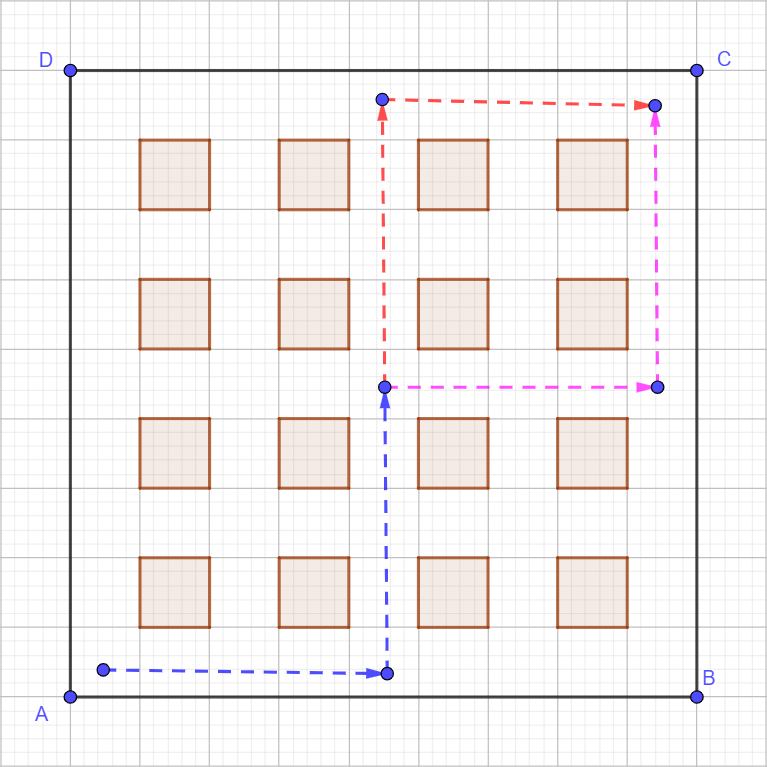

# Tiểu học: Đếm
## Question 1. HOW MANY ROUTES?

"In our Mathematics Circle we diagramed 16 blocks of our city. How many different routes can we draw from A to C moving only upward and to the right?

Different routes may, of course, have portions that coincide (as in the diagram).

“This problem is not easy. Have we solved it by counting 70 different routes?” What answer should we give these students?"

("Trong Câu lạc bộ Toán học, chúng tôi đã vẽ sơ đồ 16 khu phố của thành phố. Có bao nhiêu lộ trình khác nhau mà chúng ta có thể vẽ từ A đến C chỉ di chuyển lên trên và sang phải?

Các lộ trình khác nhau, tất nhiên, có thể có các phần trùng nhau (như trong sơ đồ).

Bài toán này không dễ. Liệu chúng ta đã giải được nó bằng cách đếm ra 70 tuyến đường khác nhau chưa? Chúng ta nên đưa ra câu trả lời nào cho những học sinh này?")

**Hướng dẫn giải**

Đây là một bài toán tổ hợp cổ điển về việc tìm số đường đi trên một lưới. Chúng ta có thể giải bài toán này bằng hai phương pháp chính.

Phân tích bài toán:

Để đi từ điểm A (góc dưới bên trái) đến điểm C (góc trên bên phải), chúng ta phải di chuyển qua một lưới 4x4 (gồm 16 ô vuông).

Mỗi lộ trình phải bao gồm chính xác 4 bước đi lên (Upper) và 4 bước đi sang phải (Right).
Tổng cộng, mỗi lộ trình hợp lệ sẽ có đúng 8 bước (4 lên + 4 phải).
Vấn đề đặt ra là tìm số cách sắp xếp khác nhau của 4 bước 'lên' và 4 bước 'phải'.

Phương pháp 1: Sử dụng Tổ hợp (Combinations)

Ta có một chuỗi gồm 8 bước đi. Chúng ta cần chọn 4 vị trí trong chuỗi 8 bước này để đi lên (các vị trí còn lại sẽ mặc định là đi sang phải).

Số cách để chọn 4 vị trí cho các bước "lên" từ 8 vị trí tổng cộng được tính bằng công thức tổ hợp "n chọn k", hay C(n, k):

$C_n^k = \dfrac{n!}{k!(n-k)!}$

Trong đó:
n = 8 (tổng số bước đi)
k = 4 (số bước đi lên)
Áp dụng công thức:

$C_8^4 = \dfrac{8!}{4!(8-4)!}$

$C_8^4 = \dfrac{8!}{4!4!}$

$C_8^4 = \dfrac{8 \times 7 \times 6 \times 5 \times 4 \times 3 \times 2 \times 1}{(4 \times 3 \times 2 \times 1) \times (4 \times 3 \times 2 \times 1)}$

$C_8^4 = \dfrac{8 \times 7 \times 6 \times 5}{4 \times 3 \times 2 \times 1}$

$C_8^4 = \dfrac{1680}{24}$

$C_8^4 = 70$

Vậy, có chính xác 70 lộ trình khác nhau.

Phương pháp 2: Sử dụng Tam giác Pascal (Dynamic Programming)

Phương pháp này tính số cách để đến mỗi giao lộ trên lưới. Số cách để đến một giao lộ bất kỳ bằng tổng số cách đến giao lộ ngay bên dưới nó và giao lộ ngay bên trái nó.

Bắt đầu tại điểm A. Có 1 cách để ở đó (điểm xuất phát).

Tất cả các giao lộ ở cạnh dưới cùng và cạnh trái cùng đều chỉ có 1 cách để đến (chỉ đi sang phải hoặc chỉ đi lên).
Tính toán cho các giao lộ còn lại bằng cách cộng hai số từ dưới và từ trái.

| 1 | → | 5 | → | 15 | → | 35 | → | 70 (C) |
|---|---|---|---|---|---|---|---|---|
| ↑ |  | ↑ |  | ↑ |  | ↑ |  | ↑ |
| 1 | → | 4 | → | 10 | → | 20 | → | 35 |
| ↑ |  | ↑ |  | ↑ |  | ↑ |  | ↑ |
| 1 | → | 3 | → | 6 | → | 10 | → | 15 |
| ↑ |  | ↑ |  | ↑ |  | ↑ |  | ↑ |
| 1 | → | 2 | → | 3 | → | 4 | → | 5 |
| ↑ |  | ↑ |  | ↑ |  | ↑ |  | ↑ |
| (A) 1 | → | 1 | → | 1 | → | 1 | → | 1 |

Đáp số: 70 lộ trình.
