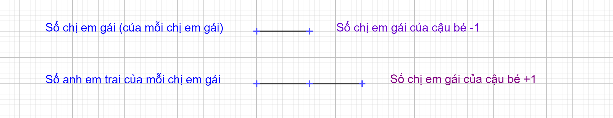

## Question 1.
A boy has as many sisters as brothers, but each sister has only half as many sisters as brothers. How many brothers and sisters are there in the family?

(Một cậu bé có số chị em gái bằng số anh em trai, nhưng mỗi chị em gái chỉ có một nửa số chị em gái so với số anh em trai. Hỏi trong gia đình có bao nhiêu anh em trai và chị em gái?)

**Hướng dẫn giải**

Cách 1: (đặt ẩn)

Gọi:
- $b$ = số anh em trai (không tính cậu bé trong câu hỏi)
- $s$ = số chị em gái

Từ câu đầu tiên: "A boy has as many sisters as brothers"
- Cậu bé có số chị em gái bằng số anh em trai
- Số chị em gái của cậu bé = $s$
- Số anh em trai của cậu bé = $b$
- Vậy: $s = b$

Từ câu thứ hai: "each sister has only half as many sisters as brothers"
- Mỗi chị em gái có số chị em gái bằng một nửa số anh em trai
- Số chị em gái của mỗi chị em gái = $s - 1$ (trừ chính mình)
- Số anh em trai của mỗi chị em gái = $b + 1$ (bao gồm cả cậu bé trong câu hỏi)
- Vậy: $s - 1 = \dfrac{b + 1}{2}$

Thiết lập hệ phương trình:
1) $s = b$
2) 
3) $s - 1 = \dfrac{b + 1}{2}$

Thay phương trình 1 vào phương trình 2:
$b - 1 = \dfrac{b + 1}{2}$

Nhân cả hai vế với 2:

$2\times(b - 1) = b + 1$

$2\times b - 2\times 1 = b + 1$

$2\times b - 2 = b + 1$

$2\times b - b = 1 + 2$

$b = 3$

Vì $s = b$, nên $s = 3$

Đáp số: Trong gia đình có 3 anh em trai và 3 chị em gái (tổng cộng 7 người con).

Cách 2: (dùng tỉ số)

Ta có sơ đồ: 

Hiệu số phấn bằng nhau là: 2-1=1 phần

Giá trị 1 phần là: 2.

Số chị em gái là: $2\times 1+1=3$

Số anh em trai là: $2\times 2=4$
