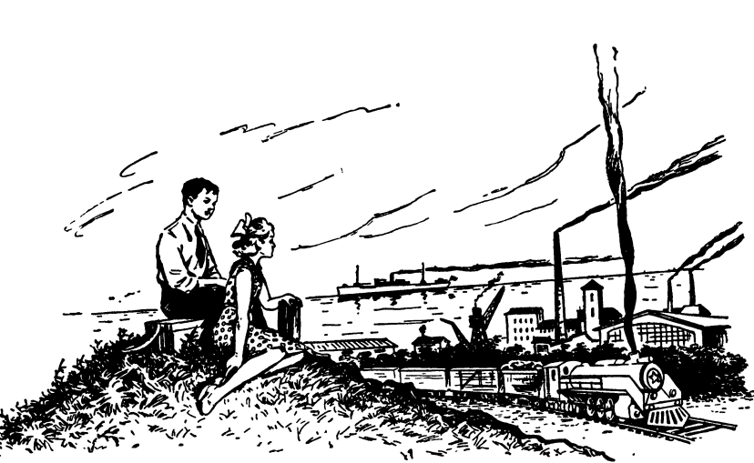

# Chuyển động
## Question 1.
A boy and a girl, after finishing some weather measurements, are resting on a hill. A freight train passes by, puffing and working hard to go up a slope. The wind is blowing steadily without gusts.

The boy asks, “What was the wind speed we measured?” 

The girl replies, “Twenty miles per hour.”

The boy says that’s enough to know the train’s speed. 

The girl is skeptical at first, but the boy explains: “Just watch the train’s movement closely.” After thinking for a while, the girl understands.
They both realize the train’s speed, exactly as shown in the illustration.

(Một cậu bé và một cô bé vừa hoàn thành một số phép đo thời tiết và đang nghỉ ngơi trên một gò đất. Một đoàn tàu chở hàng đang chạy qua, đầu máy phun khói và rít mạnh khi kéo các toa lên một con dốc nhẹ. Gió thổi đều, không có những cơn giật.
Cậu bé hỏi:

– “Tốc độ gió mà chúng ta đo được là bao nhiêu?”

Cô bé trả lời:

– “20 dặm một giờ.”

Cậu bé nói:

– “Thế là đủ để biết tốc độ của tàu.”

Cô bé tỏ vẻ nghi ngờ. Cậu bé giải thích:

– “Chỉ cần quan sát kỹ hơn chuyển động của tàu.”

Cô bé suy nghĩ một lúc rồi cũng hiểu ra.
Họ đều nhận ra tốc độ của tàu, đúng như trong bức tranh đã thể hiện.)

{:style="width:300px;"}

**Hướng dẫn giải**

Dữ kiện chính:

Gió thổi đều 20 dặm/giờ.

Có thể suy ra tốc độ tàu chỉ bằng cách quan sát.

Không đề cập đến đo thời gian hay khoảng cách, nghĩa là có một dấu hiệu trực quan liên quan đến khói tàu.

Phân tích:

Khi tàu chạy, khói từ ống khói bị gió thổi ngược.

Nếu tàu đứng yên, khói sẽ bay ngược hoàn toàn theo hướng gió.

Nếu tàu chạy ngược hướng gió, khói sẽ nghiêng ra phía sau theo một góc.

Nếu tàu chạy cùng hướng gió và tốc độ tàu bằng tốc độ gió, khói sẽ bay thẳng lên (vì gió tương đối bằng 0 so với tàu).

Kết luận:

Trong bài, trẻ chỉ cần “quan sát kỹ” để biết tốc độ tàu → nghĩa là khói đang bốc thẳng đứng.

Điều đó xảy ra khi tốc độ tàu = tốc độ gió (và cùng hướng).

Đáp án:
Tốc độ tàu = 20 miles per hour (32 km/h).
