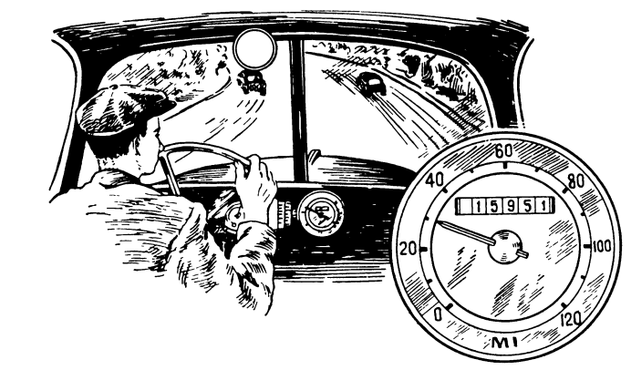

# Question 2.
The odometer of the family car shows 15,951 miles. The driver noticed that this number is palindromic: it reads the same backward as forward.

"Curious," the driver said to himself. "It will be a long time before that happens again."

But 2 hours later, the odometer showed a new palindromic number.

How fast was the car traveling in those 2 hours?

(Đồng hồ đo quãng đường của chiếc xe gia đình chỉ 15,951 dặm. Người lái xe nhận thấy rằng con số này là một số đối xứng (palindromic): nó đọc giống nhau dù từ trái sang phải hay từ phải sang trái.

"Thật kỳ lạ," người lái xe tự nhủ. "Sẽ còn rất lâu nữa điều đó mới xảy ra lần nữa."

Nhưng 2 giờ sau, đồng hồ đo quãng đường đã hiển thị một con số đối xứng mới.
Hỏi chiếc xe đã đi với vận tốc bao nhiêu trong 2 giờ đó?)

{:style="width: 50%;"}

**Hướng dẫn giải**

Số đo ban đầu: Đồng hồ đang chỉ 15,951 dặm.

Tìm số đối xứng tiếp theo: Chúng ta cần tìm số đối xứng nhỏ nhất mà lớn hơn 15,951.
Số hiện tại là 15951.

Để tìm số đối xứng tiếp theo, chúng ta cần tăng giá trị của số này. Hãy xét các chữ số từ giữa ra. Nếu ta tăng chữ số ở giữa (9), nó sẽ thành 0 và chữ số bên trái nó (5) sẽ tăng lên 6.

Khi đó, ba chữ số đầu tiên sẽ là 160.

(Nếu chúng ta không thay đổi chữ số ở giữa, mà thay đổi các chữ số bên trái và bên phải của nó: Ví dụ thay đổi số 5 thành số 6 thì ta có số: 16,961 lớn hơn số 16061, đây không là số đối xứng nhỏ nhất và lớn hơn 15951. Hi vọng các em học sinh có thể tìm ra cách lập luận tốt hơn.)

Để tạo thành một số đối xứng, hai chữ số cuối phải là đảo ngược của hai chữ số đầu (16), tức là 61.

Vậy, số đối xứng tiếp theo ngay sau 15,951 là 16,061.

Tính quãng đường đã đi: Ta lấy số đo mới trừ đi số đo ban đầu.

Quãng đường = 16,061 - 15,951 = 110 dặm.

Tính vận tốc của xe: Chiếc xe đã đi 110 dặm trong vòng 2 giờ.

Vận tốc = Quãng đường / Thời gian

Vận tốc = 110 dặm / 2 giờ = 55 dặm/giờ (mph).

Đáp án: Chiếc xe đã di chuyển với vận tốc 55 dặm/giờ.

